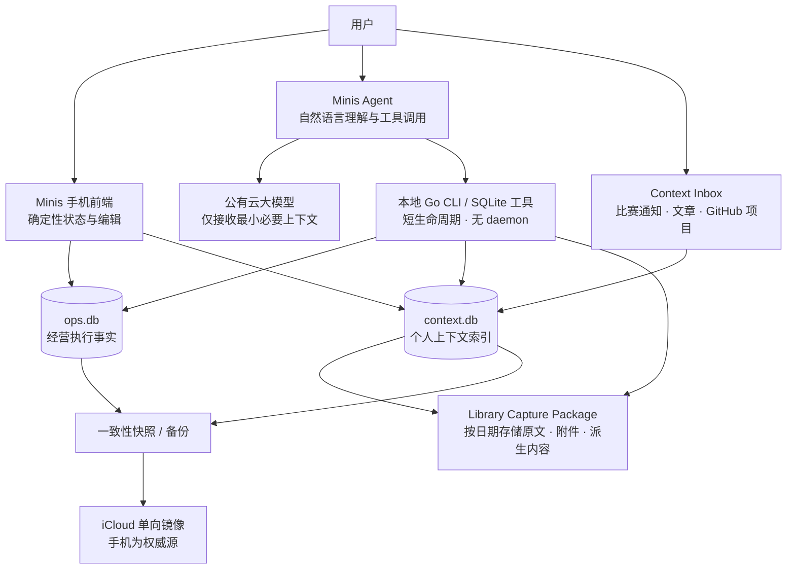

# Design：个人经营上下文系统 B+

生成日期：2026-08-21  
状态：APPROVED（总体思路已确认，详细实现见技术分册）  
版本：0.4（明确 Capture Package / Item / Version / Component / Asset 粒度）  
模式：Builder / 个人自用优先  
范围：设计文档，不包含数据库迁移或产品实现

技术实现分册：[Go CLI 与静态前端技术架构](./个人经营上下文系统_GoCLI与静态前端_技术设计.md)

## 1. 结论

采用 **B+：经营执行核心 + 个人上下文层**。

- `ops.db` 是目标、项目、任务、计划和执行事件的唯一事实源。
- `context.db` 保存可检索、可追溯的个人工作上下文，包括人物、组织、会议、文档、事实、关系和来源证据。
- `Library` 是非结构化资料的权威存储：原文按捕获日期进入不可变的 Capture Package，结构化元数据则提供类似 Notion 的多维视图。
- `Context Inbox` 是外部信息进入系统的缓冲层：比赛通知、博主文章、GitHub 项目等先作为信号和原始资料保存，不默认转成任务。
- Markdown、PDF、录音和其他原始文件继续保存在文件系统中；数据库保存元数据、索引、关系和来源定位，不重复吞掉原文件。
- Minis 是 Agent 产品与本地 Runtime：公有云模型负责理解和推理，本地 Go CLI + SQLite 负责确定性查询与写入；Python 保留为迁移和外围扩展。
- 手机前端通过 Minis Bridge 读取 SQLite 与 Library，并通过受控 Go 用例写入，是人的控制台；不新增常驻传统后端。
- 系统只展示状态、容量、冲突和历史，不替用户做优先级判断，不自动改期。
- MyContext 作为架构参考，不作为 Minis 手机端依赖。

外部信息遵循固定链路：

```text
捕获原文 → 建立来源与快照 → 进入 Context Inbox → 人工分流
                                              ├── 仅作参考
                                              ├── 关联现有项目
                                              ├── 设置复查时间
                                              └── 创建任务/项目/机会
```

## 2. Problem Statement

过去一至两周，Minis 已经积累出真实的个人经营数据：任务、项目、OKR、里程碑、日报、战略决策、讨论、会议原文、云深处研究材料和交付物。这说明系统已有真实使用价值，但现有结构正在失去可读性：

1. `nodes` 同时承载 O、KR、PROJ、SUB、TASK，层级语义不稳定。
2. `P0/P1/P2` 与 `critical/high/med/low` 两套优先级并存。
3. `due_date` 同时承担硬截止、计划完成日和阶段结束日。
4. 旧 `projects/tasks/schedule` 与新 `nodes` 两套模型并存，形成重复事实源。
5. 一天可能同时出现多个 `critical`，系统却没有个人可用时间和预计工时，因而无法显示日期是否超载。
6. 小红书、国风小游戏、雷电/飞机、数据标注等工作在层级上互相交叉，战略方向、阶段项目和具体任务没有被稳定区分。
7. 任务改期后缺少完整历史，重要事项可能从当前视图中无声消失。
8. 非结构化资料已有相当积累，但会议、文档、项目、客户与行动之间尚未形成可靠关联。
9. 比赛通知、博主文章和 GitHub 新项目介于“资料”与“潜在行动”之间；当前模型没有合适位置，容易被误建成任务，或保存后彻底遗忘。

第一阶段要解决的问题不是“让 AI 替用户做决定”，而是：

> 让用户在 30 秒内看清今天、明天和未来七天的真实负载，发现冲突，手动完成改期，并确保任何重要事项都不会因为暂时不做而消失。

## 3. What Makes This Cool

这套系统最有价值的体验不是一张更漂亮的待办清单，而是同一份本地事实同时被人和 Agent 理解：

- 手机前端用确定性的视图显示“今天有 8 件事、预计 11 小时、可用 6 小时”。
- 用户自己把国金证券物业事项拖到下周二或周三。
- SQLite 保留原计划、新计划、调整原因和操作来源。
- 下一次询问 Minis“明天做什么”时，Agent 从同一份数据库读取最新状态，不依赖聊天记忆猜测。
- 打开某个云深处任务时，可同时看到关联会议、客户联系人、研究材料、关键结论和交付文档，并能回到原始依据。
- 健康和财务以后接入时，不破坏现有执行核心，也不会把所有敏感原始数据默认交给公有云模型。

## 4. 已确认的 Premises

1. 第一阶段优先重构任务、项目和日程；客户、健康、财务只预留扩展边界。
2. 系统展示事实、容量和冲突，不替用户自动排优先级或改期。
3. SQLite 是结构化事实源；原始非结构化资料继续由文件系统保存。
4. Minis 是 Agent Runtime 和操作入口，背后可接公有云大模型；模型通过本地受控工具使用数据。
5. 每次延期、改状态、改计划和改优先级都可追溯，任务不能无声消失。
6. 手机前端与 Minis Agent 均可访问本地数据，但正式写入统一经过 Go Application Use Case；不建设常驻传统后端。
7. “最全的上下文枢纽”不等于“所有数据塞进一张数据库”，而是让不同数据域可以被一致发现、关联和授权使用。
8. 信息捕获不等于任务创建；任何文章、通知或项目链接都可以在没有下一步行动的情况下长期保留。

## 5. Approaches Considered

### A. 原库修补

继续扩展 `tasks.db/nodes`，补充计划日期、硬截止、预计工时和复查时间。

- 工作量：S
- 风险：低
- 优点：最快上线，现有脚本改动小。
- 缺点：旧模型语义混乱会继续累积；不适合作为长期上下文枢纽。

### B. 重建经营执行核心

新建 `ops.db v2`，迁移现有有效任务和项目，旧库只读归档。

- 工作量：M
- 风险：中
- 优点：彻底分离项目、任务、计划、截止和历史；最能解决当前痛点。
- 缺点：还没有完整的文档、会议和人物上下文层。

### B+. 经营执行核心 + 个人上下文层（选定）

在 B 的基础上增加独立 `context.db`，吸收 MyContext 的来源、证据、增量采集、事实和关系思想。

- 工作量：M/L，按阶段交付
- 风险：中，可通过先执行、后上下文控制范围
- 优点：解决当前任务混乱，同时为客户、会议、健康和财务提供长期演进方向。
- 缺点：需要严格控制第一阶段范围，避免过早建设完整知识图谱。

### C. 一步建设统一个人知识图谱

现在就把业务、健康、财务、知识和人物统一抽象成图谱。

- 工作量：XL
- 风险：高
- 优点：概念统一。
- 缺点：真实样本仍不足，容易为抽象而抽象，并拖延眼前最有价值的任务视图。

## 6. 总体架构



### 6.1 权威性

- 手机内 Minis 数据为权威源。
- Mac 上 `Minis Shared` 是手机到 iCloud 的单向镜像，只用于查看、备份和分析。
- 不允许把 Mac 上对镜像文件的修改视为回写手机的方式。
- 数据库对外同步应使用 SQLite 一致性快照，不应在未知写入状态下直接复制活跃数据库文件。

### 6.2 数据域边界

| 数据域 | 物理存储 | 责任 |
|---|---|---|
| 经营执行 | `ops.db` | 目标、方向、项目、任务、计划、容量、依赖、事件 |
| 个人上下文 | `context.db` | 来源、文档索引、人物、组织、事实、关系、证据、采集状态 |
| 外部信号/收集箱 | `context.db` + 原始文件 | 比赛通知、文章、项目链接的捕获、分流、复查与行动关联 |
| 非结构化资料库 | `Library` 文件系统 + `context.db` 元数据 | 按日期保存 Markdown、PDF、HTML、图片、录音和项目产物，支持版本、关系与多维视图 |
| 健康（以后） | `health.db` | 原始健康时间序列与日级摘要，独立权限 |
| 财务（以后） | `finance.db` | 账户、流水、预算和月度摘要，独立权限 |

不同数据库使用稳定的全局 ID 和 `domain_links` 关联，不依赖跨库外键。

## 7. `ops.db` 设计

### 7.1 稳定层级

采用四层经营结构，目标/KR 作为横向结果体系：

```text
Area（长期经营领域）
└── Initiative（阶段方向/工作流）
    └── Project（有明确结果和生命周期）
        └── Task（可执行行动）

Objective / KR 通过关联表连接 Initiative 与 Project
```

小红书案例应整理为：

```text
Area：市场与个人 IP
└── Initiative：小红书内容增长
    ├── Project：国风小游戏活动参赛与发布
    └── Project：雷电飞机无尽模式迭代与发布
```

“数据标注”属于现金流领域的独立方向，不应仅因为短期时间冲突而与个人 IP 混在同一项目树里。

### 7.2 核心表

#### `areas`

长期存在的经营领域，例如现金流、客户与销售、产品、市场与个人 IP、公司运营、个人事务。

关键字段：`id`、`name`、`status`、`sort_order`、`created_at`、`updated_at`。

#### `initiatives`

一个季度或阶段内持续推进的方向，不要求像项目一样明确结束。

关键字段：`id`、`area_id`、`name`、`status`、`start_date`、`review_date`、`description`。

#### `objectives` 与 `key_results`

只描述结果，不直接承担任务树职责。

KR 具有单一度量定义：`metric_name`、`metric_unit`、`target_value`、`current_value`、`horizon`。

#### `projects`

有明确产出、开始和结束条件的有限工作。

关键字段：

- `id`、`initiative_id`、`name`
- `status`：`planned/active/waiting/paused/done/cancelled/archived`
- `stage`：`discover/plan/build/deliver/operate/close`
- `importance`：统一为 `P0/P1/P2/P3`
- `target_date`：期望完成日，不自动等于硬截止
- `hard_due_at`：外部约束形成的真实硬截止，可为空
- `next_review_at`：暂停或等待时的重新查看时间
- `outcome`、`completion_criteria`
- `legacy_ref`：保留旧数据库来源

#### `tasks`

只保存可执行行动，不再保存 Objective 或 Project。

关键字段：

- `id`、`project_id`、`parent_task_id`
- `title`、`detail`、`completion_criteria`
- `status`：`inbox/todo/doing/waiting/done/cancelled/archived`
- `importance`：`P0/P1/P2/P3`
- `hard_due_at`：不可错过的截止时间，可为空
- `earliest_start_at`：最早可开始时间，可为空
- `next_review_at`：等待/暂缓事项何时重新出现
- `estimate_minutes`：用户输入的预计工时
- `waiting_for`：等待的人或条件
- `created_at`、`updated_at`、`completed_at`
- `version`：并发更新的乐观锁版本
- `legacy_ref`

`hard_due_at` 不得被前端当作普通计划日期拖动。改硬截止需要明确操作并记录原因。

#### `task_schedules`

保存“打算什么时候做”，与任务本体分离。

关键字段：

- `id`、`task_id`
- `planned_date`、`time_slot`、`start_at`、`end_at`
- `planned_minutes`
- `status`：`active/completed/superseded/cancelled`
- `superseded_by`
- `created_by`：`user_ui/agent/migration`
- `created_at`、`note`

改期不是覆盖旧日期，而是把旧 schedule 标为 `superseded` 并创建新记录。

#### `daily_capacity`

只记录用户声明的可用时间，不由系统推断。

关键字段：`date`、`available_minutes`、`note`、`updated_at`。

若某天没有设置，可使用用户配置的工作日/周末默认值；界面必须标明“默认容量”。

#### `project_kr_links`

Project 与 KR 多对多关联，替代把项目硬塞到 KR 的树下。

#### `task_dependencies`

支持 `blocks/requires/related`。系统展示阻塞关系，但不替用户自动重新排期。

#### `events`

所有关键变化的审计日志：

- `entity_type`、`entity_id`
- `event_type`：`created/status_changed/rescheduled/importance_changed/deadline_changed/linked/unlinked/note`
- `before_json`、`after_json`
- `actor_type`、`actor_id`
- `reason`、`occurred_at`
- `correlation_id`：一次复合操作中的多条事件可关联

事件表是回溯依据，不作为当前状态查询的唯一来源。

### 7.3 确定性视图

所有“状态看板”由 SQLite View 或等价固定查询产生，不依赖模型临时判断。

| 视图 | 定义 |
|---|---|
| `v_today` | 今天 active schedule + 今天硬截止 + 今天复查事项 |
| `v_tomorrow` | 明天 active schedule + 明天硬截止 + 明天复查事项 |
| `v_next_7_days` | 未来七天计划、截止与复查全景 |
| `v_overdue` | 硬截止已过且未完成 |
| `v_overloaded_days` | 计划分钟合计大于声明容量 |
| `v_unscheduled_important` | P0/P1 且未安排、未等待、未完成 |
| `v_review_due` | `next_review_at` 已到期 |
| `v_blocked` | 被未完成依赖阻塞或状态为 waiting |
| `v_projects_without_next_action` | active 项目没有 todo/doing 或未来 schedule |
| `v_data_quality_issues` | 缺预计工时、日期语义未确认、孤儿引用等 |

“今天有 8 个重要事项，完成不了”应呈现为事实：任务数、总预计分钟、可用分钟、超载分钟。系统不自动选出要删除的五件事。

### 7.4 国金证券物业事项的行为示例

假设任务原计划 2026-08-21，用户决定放到下周二：

1. 旧 `task_schedules` 记录保留并标记 `superseded`。
2. 新建 `planned_date = 2026-08-25` 的 active schedule。
3. 写入 `events.event_type = rescheduled`，保存前后日期和原因。
4. 任务从今日视图消失，立即出现在未来七天的 8 月 25 日列。
5. 如果没有选择具体日期，只选择“下周再看”，则设置 `next_review_at`，进入 `v_review_due`，不能彻底隐藏。

## 8. `context.db` 设计

### 8.1 设计原则

借鉴 MyContext，但不引入其 Electron、Node 22、Qdrant 和完整图谱运行时：

1. 原始来源与模型派生内容分开。
2. 每条事实保留来源证据。
3. 冲突事实并存，未经用户确认不静默覆盖。
4. 增量采集，记录 checkpoint 和去重键。
5. AI 是上下文消费者，不是数据所有者。

### 8.2 核心表

#### `sources`

描述数据源：Minis Markdown、会议记录、日历、聊天导出、健康数据、财务账单等。

关键字段：`id`、`type`、`name`、`scope`、`sensitivity`、`cloud_policy`、`enabled`。

#### `source_items`

一条可独立追溯的原始记录。

关键字段：

- `source_id`、`source_key`（源内稳定去重键）
- `item_type`、`title`、`occurred_at`、`observed_at`
- `relative_path` 或 `external_uri`
- `content_hash`、`mime_type`、`size_bytes`
- `ingest_status`

对网页或在线项目，除 canonical URL 外，还应保存“当时看到的版本”：抓取时间、标题、作者、发布时间、内容哈希和本地快照路径。网页后来变化时，新快照作为新版本保存，不覆盖旧版本。

#### `inbox_items`

`Context Inbox` 的用户可见记录。一条原始资料进入系统后，可以先停留在这里，不要求立刻产生行动。

关键字段：

- `id`、`source_item_id`
- `kind`：`competition_notice/article/github_repo/event/policy/reference/other`
- `triage_status`：`unreviewed/reference/watch/actionable/ignored/archived`
- `importance`：可为空；没有人工判断时不由模型擅自设置
- `review_at`：即使不创建任务，也可指定未来重新查看时间
- `user_note`：用户保存它的原因
- `captured_at`、`reviewed_at`
- `version`：防止前端与 Agent 相互覆盖

`unreviewed` 只是“尚未分流的信息”，不是 todo，也不计入今日任务负载。

#### `content_annotations`

保存对捕获内容的派生理解，与原文分开：

- `annotation_type`：`summary/insight/deadline_hint/requirement_hint/topic/user_note`
- `content_json`
- `created_by`：`user/agent/import`
- `model_info`：模型生成时记录模型与提示版本
- `evidence_location`：指回原文位置
- `status`：`draft/confirmed/rejected/superseded`

模型可以提取“报名截止日期可能是 9 月 3 日”，但在用户确认前它只是 hint，不能直接成为任务硬截止。

#### `entities` 与 `entity_aliases`

实体类型第一阶段只开放：`person/organization/project/topic/event/document`。

不急于把所有名词实体化；只有会被查询、关联或复用的对象才进入实体表。

#### `facts`

结构化陈述，例如“杨总负责云深处 AI 转型对接”或“项目下一次同步在 8 月 21 日”。

关键字段：

- `subject_entity_id`、`predicate`
- `object_entity_id` 或 `object_value_json`
- `valid_from`、`valid_to`
- `confidence`
- `status`：`extracted/confirmed/disputed/superseded`
- `conflict_group_id`
- `created_by`：`user/agent/import`

#### `relations`

保存实体间稳定关系，例如 `person works_at organization`、`project belongs_to organization`、`meeting relates_to project`。

#### `evidence`

把事实和关系连回原始资料：`fact_id/relation_id`、`source_item_id`、定位信息、内容哈希、简短摘录。

摘录只用于核对，不替代原始文件。

#### `document_chunks`

第一阶段用于本地全文检索。若运行环境支持 SQLite FTS，则构建 FTS 索引；否则使用标题、元数据和受限文本搜索。

不在第一阶段引入 Qdrant。

#### `ingest_runs` 与 `ingest_checkpoints`

记录每次采集、处理数量、错误和最后进度，避免每次全量重读。

#### `domain_links`

把上下文实体与业务对象关联：

```text
context entity: 云深处项目
        ↕
domain link: ops.db / projects / <global-id>
```

它也负责保存“资料如何变成行动”的来源链：

- `created_from`：任务/项目由该通知或文章创建
- `inspired_by`：行动受到文章启发，但文章不是正式依据
- `evidence_for`：资料是某个判断或任务的正式依据
- `related_to`：一般关联

因此，从 GitHub 项目创建“学习该项目”任务后，任务可以随时回到原 README 快照、仓库链接和用户当时的保存说明。

### 8.3 Context Inbox：信息先进入系统，再决定是否行动

#### 捕获类型

1. **比赛通知**：保存原始通知、主办方、链接、发布时间和附件；模型可以提取报名/提交日期、资格和交付要求作为待确认提示。
2. **博主文章**：保存原文或用户授权的本地快照、作者、平台、发布时间、URL 和保存理由。
3. **GitHub 项目**：保存仓库 URL、README 快照、默认分支、许可证、抓取时间以及当时的公开元数据；后续数据变化作为新观察版本。
4. **活动/政策/机会信息**：保存原始通知与关键日期提示，但不自动变成商机或任务。
5. **普通参考资料**：允许只收藏、只关联主题，不需要任何下一步。

捕获不得绕过登录、付费墙或访问权限；只保存用户有权访问或主动提供的内容。

#### 人工分流动作

用户打开一条 Inbox 卡片后，可以选择：

- **仅作参考**：进入资料库，不再提醒。
- **关联项目/主题**：与现有项目、人物、组织或主题建立关系。
- **稍后复查**：设置 `review_at`，届时重新出现在“待复查信息”视图。
- **创建任务**：用户确认标题、项目、计划日期和重要程度后，写入 `ops.db` 并建立 `created_from` 链接。
- **创建项目/机会**：适用于比赛或值得持续研究的新方向，仍需用户确认。
- **忽略/归档**：保留捕获和审计记录，但退出活跃收件箱。

系统可以提出候选动作，例如“是否创建学习任务”，但默认动作永远是“保存资料，不创建行动”。

#### Context Inbox 的确定性视图

| 视图 | 定义 |
|---|---|
| `v_inbox_unreviewed` | 已捕获但尚未人工分流 |
| `v_inbox_review_due` | 到达 `review_at` 的 watch/reference 项 |
| `v_inbox_deadline_hints` | 含模型提取日期提示、尚未确认的通知 |
| `v_inbox_action_links` | 已经创建任务/项目及其原始来源 |
| `v_inbox_unlinked_high_value` | 人工标记为重要但既未关联也未设置复查时间 |

### 8.4 当前资料的首批接入范围

首批只处理已经存在的数据：

- `notes/yunshen_20260818/` 的两场会议原文与摘要
- 云深处研究材料和交付物
- `notes/decisions/`、`notes/discussions/`、`notes/plans/`
- `daily_reports/`
- 与 `ops.db` 中项目明确相关的 Markdown/PDF/HTML
- 首批选择少量比赛通知、博主文章和 GitHub 项目验证 Context Inbox，不进行全量浏览器历史导入

首批不进行全盘扫描，不自动接入私人聊天、健康或财务数据。

## 9. 非结构化资料库 `Library`

### 9.1 定位：文件与元数据同等重要

`Library` 不是附件目录，也不是 `context.db` 的附属品，而是个人上下文系统的第三个核心：

```text
ops.db       回答：我要推进什么、计划何时做、现在是什么状态？
context.db   回答：这件事涉及谁、哪些事实、关系和来源？
Library      回答：原始资料、过程材料和最终产物究竟在哪里、当时是什么版本？
```

非结构化资料包括两大来源：

1. **外部资料**：比赛通知、博主文章、GitHub README、政策、活动信息、行业报告、网页和他人分享的文档。
2. **内部产物**：会议原文与摘要、项目研究、方案、草稿、交付物、日报、决策记录、截图、录音、代码包和导出结果。

两者使用同一套文档库、版本和关系模型，但进入流程不同：外部资料默认进入 Context Inbox；明确由项目产生的内部产物可直接关联项目，不必经过收件箱分流。

### 9.2 物理目录：按捕获日期稳定落盘

所有文档按“进入个人资料库的日期”组织物理文件夹。该日期定义为 `storage_date`，使用手机本地时区 `Asia/Shanghai` 的 `captured_at` 计算，创建后永不改变。

```text
/var/minis/shared/library/
├── 2026/
│   └── 08/
│       ├── 21/
│       │   ├── cap_01J...A7/
│       │   │   ├── manifest.json
│       │   │   ├── original/
│       │   │   │   └── source.md
│       │   │   ├── attachments/
│       │   │   ├── derived/
│       │   │   │   ├── normalized.md
│       │   │   │   ├── summary.md
│       │   │   │   └── thumbnail.png
│       │   │   └── previews/
│       │   └── cap_01J...K2/
│       └── 22/
└── _system/
    ├── orphaned/
    ├── quarantine/
    └── trash/
```

设计约束：

- 目录名使用稳定、无语义的全局 Capture ID，标题变化不会触发移动或重命名。
- 年/月/日只表示资料何时进入 Library，不假装是文章发布时间、会议发生时间或项目完成时间。
- `published_at`、`occurred_at`、`file_created_at`、`project_period` 等真实业务日期单独保存在元数据中。
- 用户在 UI 中可以按任何业务日期查看，但物理路径永远按 `storage_date`，避免文件因为元数据修正而频繁移动。
- Finder/iCloud 中仍然可以按日期浏览；主要管理体验由元数据视图提供，而不是依赖用户记住文件夹路径。

### 9.3 核心粒度：五级模型

Library 不以“一个文件”为顶层单位，而采用五级模型：

```text
Capture Package  一个来源一致、语义内聚的原子归档单元，对应日期目录下一个物理文件夹
Library Item     一个可以独立命名、检索、引用和长期管理的逻辑资料对象
Item Version     某个 Library Item 在特定时间的不可变版本
Component        一个版本内部有独立语义但通常不独立管理的组成部分
Asset            实际字节文件：PDF、Markdown、照片、录音、压缩包等
```

此外使用 `Bundle` 把多个独立 Library Item 组织成更大的档案，例如一场会议的完整档案、一个邮件线程或一套跨日期交付材料。Bundle 是数据库关系，不要求把成员移动到同一个物理目录。

#### 1. Capture Package：日期目录的一级文件夹

一个 Capture Package 表示一个**来源一致、语义内聚、可以整体校验的原子归档单元**：一次网页分享、一封邮件及其附件、一套同时收到的方案、同一场会议的一组照片、一次 Git 仓库快照或一次项目导出。

它具有共同的：

- `captured_at/storage_date`
- 捕获入口和操作者
- 同一来源事件或业务容器
- 一致的权限、敏感度和保留策略
- 事务成功/失败状态
- 一份不可变 manifest

**日期目录下一级文件夹的边界由“是否属于同一个来源事件与业务容器”决定，而不是由文件数量或一次 UI 操作决定。**

因此，同一场会议一次选择并导入的 10 张照片，应建立一个 Capture Package，其中包含 10 个 Asset。若这 10 张照片分三天、三次独立导入，则形成三个 Capture Package，但仍可关联到同一个 Meeting Bundle。

一次 UI 批量导入可以产生多个 Capture Package，并用共同的 `capture_batch_id` 记录为同一操作批次。例如一次选择 10 篇互不相关的文章，应建立 10 个 Package；不能因为它们同时被选中就混入同一个物理包。

Capture Package 不是长期项目文件夹、会议总文件夹或 Item 文件夹。写入时先处于 `staging`，当原件、manifest、哈希和基础索引全部成功后转为 `sealed`；封存后不再追加或改写。后来补到的会议材料、邮件回复或方案新版本进入新日期的新 Package，再由 Item/Version/Bundle 在逻辑层聚合。

#### 2. Library Item：长期管理对象

Library Item 是用户在搜索和界面中看到的对象，例如：

- 一篇公众号文章
- 一个 Twitter/X 帖子或线程
- 一封邮件
- 一次会议记录
- 一份报价单
- 一套方案
- 一个 GitHub 仓库或代码包

一个 Capture Package 通常产生一个 Item，但不是强制一一对应：

- 一封带报价单附件的邮件，可以产生“邮件”和“报价单”两个 Item，共享同一个 Capture Package。
- 一次批量导入 10 篇彼此无关的文章，应产生 10 个 Package 和 10 个 Item；它们只共享 `capture_batch_id`。
- 10 张同一场会议的照片通常产生一个“会议照片集” Item；每张照片是 Asset 或 Component。

#### 3. Item Version：同一对象的时间版本

同一方案 v0.1、v0.2，或同一代码库不同 commit，属于一个 Library Item 的多个 Version。

如果新版本在后续日期进入系统：

- 新版本原始字节保存在新日期下的新 Capture Package。
- `item_versions` 把它关联回原 Library Item。
- 旧 Capture Package 保持不动，满足完整的时间归档。

因此，版本不会为了“放回原文档文件夹”而破坏按捕获日期组织的规则。

#### 4. Component：包内可识别组成部分

Component 用于表达“有独立语义，但暂时没有必要成为独立长期对象”的内容：

- 方案的分册与附录
- Twitter/X Thread 中的单条帖子
- 邮件正文与附件清单
- 会议照片集中的每张胶片
- 报告中的章节或数据附表

Component 有自己的标题、顺序、角色、页码/时间位置和 Asset 关联。若某个分册以后需要独立版本、权限、引用或交付，则可以提升为独立 Library Item，并通过 `part_of` 与原方案相连。

#### 5. Asset：实际文件

Asset 是实际保存的字节对象。每个 Asset 有独立的路径、MIME、大小、哈希、拍摄/创建时间和顺序。

Asset 默认不在 Library 首页单独出现；它通过 Item/Component 被管理。只有当一个文件需要被独立引用、分享、版本化或设置权限时，才提升为独立 Item。

### 9.4 Capture Package 的物理结构与 manifest

每次捕获使用一个自包含文件包：

```text
cap_<capture-id>/
├── manifest.json
├── original/
│   ├── asset_001.jpg
│   ├── asset_002.jpg
│   └── proposal-main.pdf
├── attachments/
├── derived/
│   ├── normalized.md
│   ├── summary.md
│   ├── contact-sheet.jpg
│   └── file-index.json
└── previews/
```

新日期的新版本进入新的 Capture Package，不在旧包内追加可变 `versions/` 目录。长期版本关系由 `item_versions` 管理。

`manifest.json` 保存：

- 捕获包 ID、时间、时区、来源和捕获入口
- 包内全部 Asset 的相对路径、角色、顺序、大小和哈希
- 捕获时可确定的 Item/Component 建议结构
- 捕获事务版本和校验状态

manifest 的作用是即使 `context.db` 损坏，也能从文件系统重建基础索引。它不是完整业务元数据的第二事实源：

- 捕获时信息写入后保持不可变。
- 用户后来增加的项目关联、标签、Bundle 和复查状态以 `context.db` 为准。
- 数据库可通过 manifest 和目录扫描恢复 Capture/Asset/基础 Item 记录，再从备份恢复高级关系。

### 9.5 日期模型

“按日期管理”必须区分不同日期含义：

| 字段 | 含义 | 是否决定物理路径 |
|---|---|---|
| `captured_at` | 被 Minis 保存的准确时间 | 是 |
| `storage_date` | `captured_at` 对应的本地自然日 | 是 |
| `published_at` | 外部文章/通知的发布时间 | 否 |
| `occurred_at` | 会议、活动或事件实际发生时间 | 否 |
| `file_created_at` | 原文件自身创建时间 | 否 |
| `valid_from/valid_to` | 内容中事实的有效期 | 否 |
| `project_period` | 项目阶段或交付周期 | 否 |

这样既能回答“8 月 21 日我收集了什么”，也能回答“8 月 18 日会议产生了哪些资料”，两者不会互相覆盖。

### 9.6 结构化元数据

#### `library_days`

为每个有资料进入的自然日建立结构化记录：

- `date`、`timezone`
- `item_count`、`external_count`、`internal_count`
- `total_size_bytes`
- `first_capture_at`、`last_capture_at`
- `daily_note`：可选的人工说明
- `digest_status`、`digest_item_id`：可选日级资料摘要 Item

`library_days` 使日期本身成为可查询对象，但日摘要是派生产物，不能替代当天原始资料。

#### `capture_batches`

记录一次用户或 Agent 发起的导入操作：`id`、`started_at`、`completed_at`、`capture_method`、`operator`、`status`、`package_count`、`error_summary`。Batch 只用于事务、重试和审计，不决定 Library 的内容粒度。

#### `capture_packages`

物理文件夹的数据库映射：`id`、`capture_batch_id`、`storage_date`、`package_path`、`captured_at`、`source_id`、`source_event_ref`、`capture_method`、`manifest_hash`、`status`、`asset_count`、`total_size_bytes`。

#### `library_items`

Library 的中心逻辑对象：

- `id`、`title`、`item_type`
- `origin_type`：`external/internal/generated/imported`
- `lifecycle_status`：`active/reference/archived/quarantined/trashed`
- `canonical_url`、`author_name`、`publisher_name`
- `published_at`、`occurred_at`
- `language`、`sensitivity`、`cloud_policy`
- `current_version_id`
- `created_by`：`user/agent/project/import`

Item 不保存唯一物理路径，因为一个长期 Item 可以跨多个日期 Capture Package 拥有多个版本。

`item_type` 第一阶段支持：

```text
article / social_post / email / competition_notice / policy / report / reference
quote / proposal / contract / deliverable / attachment
meeting_minutes / meeting_transcript / meeting_summary / photo_set / audio
decision / research / plan / draft / daily_report / note
repository / code_archive / dataset / image / other
```

#### `item_versions`

版本是不可变快照，并连接逻辑 Item 与日期 Capture Package：

- `item_id`、`version_no`
- `capture_package_id`
- `captured_at`、`aggregate_hash`
- `source_version`：Git commit、网页 ETag、项目版本号等
- `change_note`、`created_by`

外部网页更新、GitHub README 变化、项目方案发布 v0.2，均新增版本。UI 默认显示当前版本，同时保留每个版本实际进入系统的日期。

#### `item_components`

- `item_version_id`、`parent_component_id`
- `component_type`：`volume/appendix/post/photo/page/section/body/attachment/index/other`
- `title`、`sequence_no`、`role`
- `locator_json`：页码、时间段、帖子序号等
- `promoted_item_id`：提升为独立 Item 后的引用

#### `assets`

- `capture_package_id`、`item_version_id`、`component_id`
- `role`：`original/attachment/derived/preview`
- `relative_path`、`mime_type`、`size_bytes`、`content_hash`
- `captured_at`、`file_created_at`、`sequence_no`
- `is_rebuildable`

#### `library_relations`

连接 Item 与 Item、Item 与结构化业务对象：

- `from_item_id`
- `relation_type`
- `to_item_id` 或 `target_domain/target_type/target_id`
- `created_by`、`created_at`、`note`

核心关系类型：

| 关系 | 用途 |
|---|---|
| `created_by_project` | 文档由某项目产生 |
| `deliverable_of` | 项目的正式交付物 |
| `input_to` | 外部文章/研究是项目输入 |
| `reference_for` | 一般参考资料 |
| `evidence_for` | 事实、决策或行动的正式依据 |
| `discussed_in` | 资料在某次会议中被讨论 |
| `derived_from` | 摘要、清洗稿、方案来自另一文档 |
| `supersedes` | 新版本或新文件替代旧文件 |
| `attachment_of` | 文件是某通知/会议的附件 |
| `created_action` | 资料促成某个 task/project/opportunity |

#### `bundles` 与 `bundle_members`

Bundle 用于需要整体查看、但成员仍应独立管理的资料集合：

- 一场会议的照片集、录音、纪要、决策和附件
- 一套方案的主册、独立修订的分册与附录
- 跨日期的邮件线程
- 一个项目的阶段性交付包

Bundle 不决定物理路径；成员保留各自 Capture 日期、版本和权限。

第一阶段的 `bundle_type` 支持：`meeting_dossier/email_thread/proposal_set/delivery_set/project_dossier/other`。

#### `library_collections`

提供类似 Notion Database 的集合视图，不复制文件：

- 云深处项目资料
- 比赛与活动通知
- 个人 IP 参考文章
- 待学习 GitHub 项目
- 经营决策与复盘

同一 Item 可以进入多个 collection；collection 是视图与组织方式，不是物理目录。

#### `library_entities`

关联人物、组织、主题和事件。它与 `library_relations` 分工：前者用于语义检索，后者用于业务来源链和资料谱系。

### 9.7 Capture Package 与 Item 的边界判断

系统按以下顺序判断粒度：

1. **来源事件是否一致？** 同一网页分享、一封邮件及其附件、一套同时收到的交付材料、同一会议的一组照片或一次仓库快照可进入同一个 Capture Package；互不相关的内容即使同时导入也拆包。
2. **是否需要独立生命周期？** 需要独立命名、检索、引用、版本、权限、交付或归档的内容建立独立 Library Item。
3. **只是同一对象的内部结构吗？** 有语义、但始终随整体一起发布和版本化的部分建立 Component。
4. **只是承载字节吗？** 没有独立管理需求的 PDF、图片、音频或压缩包只作为 Asset。
5. **多个独立 Item 是否需要整体查看？** 使用 Bundle 建立虚拟档案，不移动物理文件。

判断的核心不是“有几个文件”，而是“来源事件是否一致、权限与保留策略是否一致、生命周期是否独立”。第一阶段允许先采用较粗的 Item 粒度；当分册、附件或照片出现独立管理需要时，再无损提升为 Item。

出现以下任一情况就拆成多个 Capture Package：

- 来源事件不同，例如 10 篇互不相关的文章
- 敏感度、云上传策略或访问权限不同
- 保留/删除策略不同
- 内容不能作为一个整体完成哈希校验和恢复

仅仅因为文件多、分册多或有附件，不构成拆包理由。

| 实际资料 | 推荐结构 | 拆分条件 |
|---|---|---|
| 单份会议纪要 | 1 Package → 1 Meeting Minutes Item → 1 Version → 1 Asset | 若还有录音、照片集、决策记录，则各建 Item，再组成 Meeting Bundle |
| 同一场会议一次导入的 10 张照片 | 1 Package → 1 Photo Set Item → 10 Photo Components/Assets | 某张需要独立引用、权限或版本时，将该 Component 提升为 Item |
| 公众号文章或单篇博文 | 1 Package → 1 Article Item；正文快照、原 HTML、图片作为 Assets | 页面中的附件若可独立使用或更新，另建 Item |
| Twitter/X 单帖或 Thread | 1 Package → 1 Post/Thread Item；Thread 内单帖作为 Components | 单条帖子需要独立引用时提升为 Item |
| 一封邮件 | 1 Package → 1 Email Item；正文和原始 `.eml` 为 Assets | 报价单、合同等附件需独立管理时，在同一 Package 内另建 Item；跨日期往来组成 Email Thread Bundle |
| 一份报价单 | 通常 1 Quote Item，每次修订形成新 Version | 附带可独立签署或复用的明细表时拆成子 Item |
| 多分册方案与附录 | 同时发布、共同修订时：1 Proposal Item，分册/附录为 Components | 分册可独立修订、交付、授权或签署时：多个 Item + Proposal Bundle |
| ZIP 代码包 | 1 Code Archive Item；压缩包、README、清单为 Assets | 其中包含多个真正独立的项目时拆分为多个 Item |
| Git 仓库 | 1 Repository Item；每个需保存的 commit/tag 快照是一个 Version | 不为每个源码文件建 Item；文件目录和符号索引属于可重建派生数据 |

#### 会议照片的明确规则

用户一次从手机选择同一场会议的 10 张照片时，系统建立：

```text
2026/08/21/cap_xxx/             ← 一个 Capture Package
├── manifest.json
├── original/
│   ├── asset_001.jpg
│   ├── ...
│   └── asset_010.jpg
└── derived/
    ├── contact-sheet.jpg
    └── ocr.json

Meeting Bundle                 ← 一场会议的逻辑档案，可跨日期
├── Meeting Photo Set Item     ← 10 张照片作为 Components/Assets
├── Recording Item
├── Minutes Item
├── Decision Record Item
└── Attachments Item(s)
```

所以默认答案是：**10 张照片放在一个日期下的一个 Capture Package 中，不建立 10 个顶层文件夹。** 上层汇总不是再复制一份文件，而是用 Meeting Bundle 关联照片集、录音、纪要、决策和附件。

#### 代码库的保存模式

代码库是一个长期 Library Item，不是普通附件集合。每次明确归档使用新的 Capture Package 和 Item Version，并记录：

- Git remote、commit SHA、tag、默认分支、许可证
- 保存方式：`snapshot`、`git_bundle`、`reference_only` 或 `hybrid`
- 原始 ZIP/TAR 或 Git bundle 的 Asset 哈希
- 可重建的文件树、语言统计、README 正文和符号索引

`reference_only` 只保存地址和元数据，不能称为完整原始资料；需要长期可复现时使用 `snapshot` 或 `git_bundle`。活跃代码项目仍在开发工作区中工作，Library 保存的是可引用、不可变的归档版本。

### 9.8 原始内容与派生内容

原始资料必须优先保存，且与模型处理结果严格分离：

| 类型 | 示例 | 可否覆盖 |
|---|---|---|
| Original | 原始 PDF、网页快照、README、会议录音、原始 Markdown | 否，只能新增版本 |
| Normalized | 清洗后的正文、OCR 文本、HTML→Markdown | 可重建 |
| Annotation | 用户批注、保存理由 | 保留修改历史 |
| Derived | 摘要、关键词、实体、事实、日期提示 | 可重建，需记录模型信息 |
| Project Artifact | 内部草稿、研究、方案、交付物 | 新版本替代，不覆盖历史 |

任何模型摘要都必须链接到具体 `item_id + item_version_id`。原文版本变化后，旧摘要仍属于旧版本；系统可提示重新生成，但不能静默把旧摘要当作新版本结论。

### 9.9 外部资料进入流程

```text
分享/粘贴 URL/上传文件
        ↓
创建日期 Capture Package 并保存 original
        ↓
计算 hash + 写 manifest + 写 capture_packages/assets/source_items
        ↓
建立或匹配 Library Item，并创建不可变 Item Version
        ↓
进入 Context Inbox
        ↓
异步生成 normalized/summary/date hints
        ↓
用户选择：参考 / 关联 / 复查 / 创建行动 / 归档
```

事务边界：只有 original、manifest、Capture/Asset 与基础 Item Version 元数据全部成功，捕获才算完成。模型摘要失败不能导致原始资料丢失。

### 9.10 项目产物进入流程

明确由项目产生的资料直接进入 Library，并立即建立 `created_by_project`：

```text
项目执行生成文件
      ↓
创建日期 Capture Package + Item Version
      ↓
关联 Project / Task / Meeting
      ↓
标记 Draft / Research / Deliverable
      ↓
需要时创建下一版本或正式交付关系
```

项目文件没有必要进入未分流 Inbox，但若无法识别所属项目，则进入“待关联资料”视图，等待人工处理。

会议建议建成一个 context event，并建立 Meeting Bundle：录音、原始转写、清洗稿、会议摘要、决策记录、照片集和附件按独立生命周期分别建立 Item，并使用 `derived_from/attachment_of` 关系保留来源链。无需独立管理的单张会议照片只作为照片集 Item 的 Component/Asset。

### 9.11 Notion 式管理体验

用户不需要在文件夹与数据库之间来回切换。手机端和未来 Mac 端提供同一批元数据视图：

- **按捕获日期**：日历和时间线，回答某天保存/产生了什么。
- **按业务日期**：会议发生日、文章发布日期、比赛截止日。
- **按项目**：项目输入、过程资料、决策和交付物。
- **按类型**：文章、通知、会议、研究、草稿、交付物。
- **按来源**：网站、博主、GitHub、Minis 会话、用户上传。
- **按关系**：由什么派生、支撑了什么决策、创建了什么行动。
- **待处理**：未分流、待关联、待复查、日期提示待确认。
- **版本历史**：查看某 Item 每个时间点的原文与派生结果。

Item 详情页包含：原文预览、元数据、项目/人物/组织关系、版本、Components、Assets、派生内容、相关行动和来源链。修改 collection、Bundle、标签或项目关联不会移动原始文件。

### 9.12 完整性、去重与删除

- 捕获时计算内容哈希，提示疑似重复，但默认不删除任何用户保存的原件。
- 相同 URL 不等于相同内容；使用 URL + 内容哈希 + 抓取时间判断版本与重复。
- 数据库中存在、文件不存在：进入 `orphaned` 检查视图。
- 文件存在、数据库中不存在：通过 manifest 重建基础索引并进入 `orphaned` 等待确认。
- 无 manifest 或哈希异常的文件进入 `quarantine`，不自动解析或上传。
- 删除先进入可恢复 `trash`；真正永久删除属于破坏性操作，需要明确确认。
- 文件重命名、移动、版本创建和永久删除都写入审计事件。

### 9.13 Library 的确定性视图

| 视图 | 定义 |
|---|---|
| `v_library_by_date` | 按 `storage_date/captured_at` 查看原始资料 |
| `v_library_project_artifacts` | 按项目分组的输入、过程与交付文件 |
| `v_library_unlinked` | 内部产物尚未关联项目或上下文实体 |
| `v_library_external_reference` | 外部文章、通知、GitHub 项目等 |
| `v_library_versions` | Item 版本时间线及其 Capture 日期 |
| `v_library_missing_original` | 元数据存在但原始文件缺失 |
| `v_library_unindexed_files` | 文件存在但缺少数据库记录 |
| `v_library_derived_stale` | 原文已更新但摘要/OCR 属于旧版本 |
| `v_library_by_relation` | 按 `input_to/evidence_for/deliverable_of` 等关系查询 |

## 10. 手机前端信息架构

### 10.1 首页：状态驾驶舱

首页只回答“现在是什么状态”，不替用户做选择。

1. 今日容量：已计划分钟 / 可用分钟 / 超载分钟。
2. 今日事项：按用户设定的计划顺序显示，不做 AI 重排。
3. 硬截止：今天、已逾期、未来三天。
4. 待复查：今天重新出现的暂停/等待事项。
5. 数据质量提示：重要但未排期、活动项目没有下一步。

### 10.2 周视图：主要调整界面

- 7 天列式或日历式视图。
- 每列显示任务数、计划分钟、可用分钟和超载量。
- 拖动任务只修改 `task_schedules`，不修改硬截止。
- 硬截止以不可拖动标记展示。
- 可以把任务移入“未排期”或设置“某日复查”，但不能直接让它消失。

### 10.3 项目视图

- Area → Initiative → Project 导航。
- Project 显示目标产出、阶段、硬截止、计划任务、等待事项和最近事件。
- 明确提示“进行中但没有下一行动”的项目。
- 小红书国风与雷电飞机在同一 Initiative 下并列，避免重复登记成含义不清的父子项目。

### 10.4 上下文抽屉

从任务或项目侧滑打开：

- 关联人物与组织
- 最近会议和关键结论
- 关联文件与原始来源
- 已确认事实与存在冲突的事实
- 最近状态变更和改期历史

### 10.5 搜索与 Agent

自然语言入口示例：

- “明天安排了什么？”
- “未来七天哪几天超载？”
- “国金证券物业事项现在安排在哪天？”
- “云深处项目最近一次会议结论和未完成行动是什么？”

Agent 必须先调用本地确定性查询，再组织语言。回答中区分：数据库事实、来源事实、模型归纳。

### 10.6 收集箱 / 雷达

手机端增加一个与“任务”并列的入口，避免信息收件箱污染行动清单：

- 顶部显示未分流数量、待复查数量和含日期提示的通知数量。
- 卡片优先展示原始标题、来源、作者、捕获时间和用户保存理由。
- 模型摘要与原文明确分区，摘要不能冒充原文。
- 一键动作：参考、关联、复查、创建行动、归档。
- 比赛通知显示“日期提示未确认/已确认”，只有确认后的日期才能创建硬截止。
- GitHub 项目显示原仓库与 README 快照，并能创建“学习、试用、集成评估”等候选任务。

### 10.7 资料库

资料库提供接近 Notion Database、但以本地文件为底座的体验：

- 默认进入“按日期”视图，显示某天捕获的外部资料和项目产生的内部文件。
- 可切换项目、类型、来源、人物、组织、collection 和关系视图。
- 每个日期显示资料数量、外部/内部比例和当天新增体积。
- Item 卡片显示原文类型、当前版本、来源、项目关系和派生内容是否过期。
- Item 详情页可以预览 original、查看版本、Components/Assets、打开物理文件、查看关联任务和来源证据。
- 用户更改分类或项目关联时不移动物理文件，因此同一资料能同时出现在多个视图中。
- “待关联资料”“原文缺失”“索引缺失”“派生内容过期”作为维护入口，而不是静默错误。

## 11. Agent 工具与写入协议

虽然 Minis Runtime 能执行 Python、Shell 和 SQL，日常产品操作应统一使用受控 Go CLI，避免模型或前端直接拼接任意写入 SQL。具体命令协议、npm 分发和静态前端适配见技术实现分册。

### 11.1 建议工具面

- `ops.status(date_range)`
- `ops.list_tasks(filters)`
- `ops.create_task(payload)`
- `ops.update_task(id, patch, expected_version)`
- `ops.reschedule_task(id, new_date, note, expected_version)`
- `ops.set_review_date(id, date, note)`
- `ops.link_project_kr(project_id, kr_id)`
- `context.ingest_file(path)`
- `context.capture_url(url, user_note)`
- `context.capture_text(text, source_meta, user_note)`
- `context.capture_github(repo_url, user_note)`
- `context.triage_inbox(id, decision, review_at)`
- `context.search(query, scopes)`
- `context.link(domain_ref, context_entity_id)`
- `context.show_evidence(fact_id)`
- `ops.create_from_context(inbox_id, confirmed_payload)`
- `library.capture(paths, capture_meta, item_plan)`：一次调用建立一个 Capture Batch，并按来源边界生成一个或多个 Capture Package
- `library.register_project_artifact(paths, project_id, item_type)`
- `library.add_version(item_id, paths, change_note)`：在当天新建 Capture Package 和不可变 Item Version
- `library.promote_component(component_id, item_meta)`：把分册、附件或单张照片提升为独立 Item
- `library.link(item_id, relation, target_ref)`
- `library.bundle(items, bundle_type, title)`
- `library.list_by_date(date_range, filters)`
- `library.get_item(item_id, include_versions, include_components)`
- `library.verify(scope)`

### 11.2 每次写入的固定流程

1. 校验输入枚举、日期和对象存在性。
2. 检查 `expected_version`，防止前端和 Agent 相互覆盖。
3. 开启短事务。
4. 更新当前状态表。
5. 同事务写入 `events`。
6. 提交后返回变更摘要。
7. 触发一致性快照或延迟备份通知。

### 11.3 SQLite 连接约束

- 每个连接强制启用 `foreign_keys`。
- 设置合理 `busy_timeout`。
- 所有写事务保持短小。
- 禁止前端长时间持有写锁。
- 日志模式需要与 iCloud 快照策略共同验证；不能只开启 WAL 却忽略 `.db-wal` 的一致性。

## 12. 公有云模型与隐私边界

### 12.1 最小必要上下文

本地 Runtime 先查询和裁剪，再把少量相关字段传给模型。禁止默认上传：

- 整个 SQLite 文件
- 全量会议与聊天历史
- 原始健康时间序列
- 全量银行流水或账户信息

捕获网页时，上传给模型的内容也遵循同样策略：本地可以保存完整授权快照，但模型默认只接收完成摘要或信息提取所需的片段。

### 12.2 敏感度

每个 source 和 context item 设置：

- `normal`：一般项目资料
- `internal`：客户与经营资料
- `sensitive`：合同、个人沟通、详细财务
- `restricted`：健康原始数据、身份凭证、账户密钥

并设置 `cloud_policy`：`allowed/summary_only/local_only/ask_each_time`。

### 12.3 行动控制

- 本地查询、生成视图：无需额外确认。
- 用户明确要求的本地改期或状态更新：该指令本身视为确认。
- 删除、批量覆盖、对外发送、付款、发布：必须单独确认。

## 13. 迁移策略

### Phase 0：冻结模型，不冻结业务

- 继续允许现有系统使用。
- 对当前 `tasks.db` 做一致性备份并记录校验值。
- 生成数据盘点报告：118 个 nodes、35 个 milestones、134 个 events 等。
- 建立迁移映射表，但不修改原库。

### Phase 1：建立 `ops.db v2`

- 创建版本化 migration 机制。
- 建立核心表、约束和确定性视图。
- 建立受控 Go CLI 的只读查询面；旧 Python 工具只作为迁移对照。
- 用样例数据验证首页和周视图语义。

### Phase 2：迁移现有业务数据

- 所有旧记录保留 `legacy_ref`。
- O/KR、PROJ、SUB、TASK 分别映射到新模型。
- `critical/high/med/low` 不静默转换；生成建议映射清单，由用户确认。
- 旧 `due_date` 先进入 `legacy_due_date`，分类为硬截止、目标日、计划日或未知；未知项进入数据质量视图。
- `frozen` 映射为 `paused`，同时要求 `next_review_at` 或明确归档。
- 旧 `projects/tasks/schedule` 只读归档，不再作为活跃事实源。
- 迁移后逐项校验数量、父子关系、状态和日期，不允许静默丢失。

### Phase 3：清理当前真实项目

优先人工校正：

1. 市场与个人 IP → 小红书增长 → 国风/雷电两个项目。
2. 数据标注的批次、核验和结算事项。
3. 云深处培训与 AI 转型两个相关但独立的交付项目。
4. 国金证券物业项目的下一计划日期。
5. 所有已过期但仍为 todo/doing 的 critical 任务。

### Phase 4：手机前端切换

- 先只读显示新库。
- 再开放单任务状态更新和改期。
- 最后开放项目编辑、批量调整和 Agent 写入。
- 每一步均保留回退到旧库只读查看的能力。

### Phase 5：首批上下文接入

- 建立 `context.db`。
- 建立日期型 `Library` 目录、Capture Package 与 `library_days/capture_batches/capture_packages/library_items/item_versions/item_components/assets/library_relations/bundles` 元数据。
- 先以复制和登记方式导入现有资料，原位置暂时保留，避免第一轮迁移破坏路径引用。
- 导入现有云深处会议、摘要、研究和交付文件的元数据。
- 人工确认首批人物、组织、项目关联。
- 开启来源可追溯的本地检索。
- 建立 Context Inbox，并用真实比赛通知、文章和 GitHub 项目验证“只保存、不建任务”与“确认后创建行动”两条路径。
- 完成一次“从日期目录和 manifest 重建基础索引”的恢复验证。

### Phase 6：健康与财务试点

- 先接日级健康摘要，不接全量原始时间序列到上下文层。
- 先接月度财务摘要和经营现金流，不默认上传明细给云模型。
- 验证权限、备份和删除边界后再扩大范围。

## 14. 备份、恢复与 iCloud

1. 活跃数据库写入由手机完成。
2. 每次 schema migration 前创建不可变快照。
3. 每日生成一次经 SQLite Backup API 或等价机制验证的一致性快照。
4. iCloud 镜像同步快照和原始文件，而不是把 Mac 当成双向数据库客户端。
5. 快照保留策略：最近 7 天每日、最近 8 周每周、最近 12 月每月。
6. 每月执行一次恢复演练；“有备份”不等于“可以恢复”。
7. 敏感的健康和财务快照可以单独加密，并与普通项目资料分开。

## 15. 数据质量规则

- active 项目必须有完成标准或下一复查时间。
- active 项目应至少有一个 todo/doing task，否则进入质量提示。
- P0/P1 task 必须有 schedule、hard due 或 review date 中至少一个。
- waiting task 必须填写 `waiting_for` 或 `next_review_at`。
- paused project/task 必须填写 `next_review_at` 或明确归档。
- hard due 变更必须填写原因。
- 所有外键开启并通过检查。
- 任何迁移、批量操作和 Agent 写入都必须产生事件。
- 事实与关系若来自模型提取，必须有 evidence；无来源的模型总结不能升级为 confirmed fact。
- 捕获资料默认不创建 task；从资料创建行动必须有用户确认和 `created_from` 关联。
- Inbox 项不得因为没有下一步而报数据错误；只有用户标记为重要且既无关联、无复查、未归档时才提示。
- 每个 active Library Item 必须至少有一个有效 Item Version；其 Capture Package 必须具有 original Asset、有效 manifest 和匹配的内容哈希。
- `storage_date` 必须与 `captured_at` 的 Asia/Shanghai 自然日一致，且不得因标题或业务日期改变而修改。
- Project Artifact 必须有关联项目，或明确进入 `v_library_unlinked` 等待人工处理。
- Derived 文件必须标明来源 Item Version；原文更新后旧派生内容进入 stale 视图。
- 数据库记录与文件目录必须可以双向对账；任何 orphan 都必须可见。

## 16. Success Criteria

第一阶段成功不是“表建完”，而是满足以下可观察结果：

1. 用户能在 30 秒内看清今天、明天、未来七天、逾期和超载。
2. 改期一个任务不超过两次交互，且旧日期可追溯。
3. P0/P1 事项即使未排期，也必定出现在“重要未排期”或“待复查”中。
4. 当前数据迁移零静默丢失，所有旧记录都有 `legacy_ref`。
5. 小红书、国风、雷电/飞机的层级能由用户一眼解释清楚。
6. 手机前端与 Agent 并发修改不会静默覆盖。
7. 任意 Agent 回答可以区分数据库事实、来源证据和模型归纳。
8. 云深处项目可以从任务跳转到会议、研究材料和交付物。
9. 数据库备份可以实际恢复。
10. 第一阶段不依赖 MyContext、Qdrant、Electron 或传统后端。
11. 一篇文章可以在没有任务的情况下被完整保存、搜索和关联。
12. 从比赛通知或 GitHub 项目创建行动后，可以从任务一键回到捕获时的原文与来源。
13. 用户可以按某一天查看当天进入系统的全部外部资料与内部产物。
14. 同一文件无需复制即可同时出现在日期、项目、类型和 collection 视图中。
15. 原始文件、模型摘要和项目修订版本不会互相覆盖。
16. 删除 `context.db` 的测试副本后，可以从日期目录和 manifest 重建基础 Capture、Item、Version 与 Asset 索引。

## 17. Open Questions

这些问题不阻塞总体方案，但需在详细规格阶段确定：

1. 手机前端现有 SQLite 访问层的具体 API 和事务能力。
2. 工作日与周末的默认可用分钟数。
3. 是否需要一天内的早/中/晚时间槽，还是第一版只按日期。
4. 哪些现有 due date 是真实硬截止，哪些只是旧计划日期。
5. `Area/Initiative/Project` 在中文界面的最终命名。
6. 第一版是否支持拖拽，还是先用“选择新日期”降低实现复杂度。
7. 公有云模型针对客户、健康和财务数据的默认授权策略。
8. iCloud 镜像是否改造为数据库一致性快照感知。
9. 手机端第一版的捕获入口是分享扩展、粘贴 URL，还是先从 Minis 对话中捕获。
10. 网页快照首版保存 Markdown/HTML/PDF 中的哪一种或哪几种格式。
11. 项目代码和大型数据集是完整进入 Library，还是只登记仓库/目录引用与版本哈希。
12. 会议录音等大文件是否需要设置 iCloud 同步阈值和仅本地策略。
13. 第一版是否提供 Mac 端资料库视图，还是先通过 iCloud/Finder 只读浏览日期目录。

## 18. Next Steps

### 设计确认后的顺序

1. 用 45–60 分钟完成现有活跃任务的日期语义审计：硬截止、计划日、复查日、未知。
2. 确认中文领域词汇和枚举。
3. 输出 `ops.db v2` 详细 schema 与迁移映射规格。
4. 输出手机首页和周视图线框图。
5. 使用 10–15 条真实任务做纸面/原型验证。
6. 验证后才开始数据库和前端实现。
7. 选择 5 条真实外部资料验证 Context Inbox：至少一条比赛通知、一篇博主文章和一个 GitHub 项目。
8. 选择 10 个现有非结构化文件，覆盖外部文章、会议原文、研究、项目草稿和正式交付物，验证文档类型、日期和关系模型。

### 本次 Assignment

从当前活跃事项中选出 10 条，逐条只回答四个字段：

- 重要程度
- 是否有真实硬截止
- 当前计划哪天做
- 如果暂时不做，哪天重新查看

这 10 条将作为新模型的验收样本，而不是继续用抽象示例讨论。

同时选择 5 条已经看过、但不一定有明确下一步的外部资料，分别验证：仅作参考、稍后复查、关联项目、创建行动和归档。

再选择一个真实日期（建议 2026-08-18），把当天的会议原文、摘要、研究和项目产物映射成一份 Library 日记录，验证“物理日期目录 + 结构化元数据 + 项目关系”的完整闭环。

## 19. What I Noticed

用户反复强调的不是“让系统替我决定”，而是“让我看见事情太多，然后我自己改时间”。这决定了产品的核心不是 AI 排程，而是状态透明、调整成本低和事项不丢失。

现有系统已经不是玩具：短时间内积累了任务数据库、云深处会议、研究、方案和交付物。问题不是缺数据，而是结构开始跟不上真实经营活动。最合适的动作不是推倒重来建设大平台，也不是继续给 `nodes` 加字段，而是先建立稳定的经营执行核心，再加一个可追溯的上下文层。

MyContext 的价值在于验证了“本地优先、多个来源、一份个人上下文、AI 是消费者、答案要有证据”的方向；它的完整技术栈则过重且与 Minis 重叠。因此，借鉴其边界和原则，比把它作为依赖更符合当前阶段。

用户补充的比赛通知、博主文章和 GitHub 项目揭示了另一个重要边界：**信息不是行动**。如果系统把所有值得保存的内容都变成任务，任务系统会再次失真；如果只存文件又没有复查和关联能力，资料会被遗忘。Context Inbox 因而不是普通“收藏夹”，而是原始信息进入个人上下文、但尚未形成承诺之前的缓冲层。

进一步补充的日期型资料管理揭示了第三个边界：**文件不是数据库字段，数据库索引也不能替代文件**。原始资料需要独立、稳定、可恢复的物理存储；结构化元数据负责让同一份文件在日期、项目、人物、类型和来源等不同视角下被重新组织。类似 Notion 的体验应来自多维视图，而不是不断移动和复制文件。

## 20. References

- [MyContext 项目与架构说明](https://github.com/openTrinity/mycontext)
- [MyContext Node/Electron/SQLite 依赖清单](https://github.com/openTrinity/mycontext/blob/main/package.json)
- [MyContext kl-graph 的 SQLite + Qdrant 检索架构](https://github.com/openTrinity/mycontext/tree/main/kl-graph)
