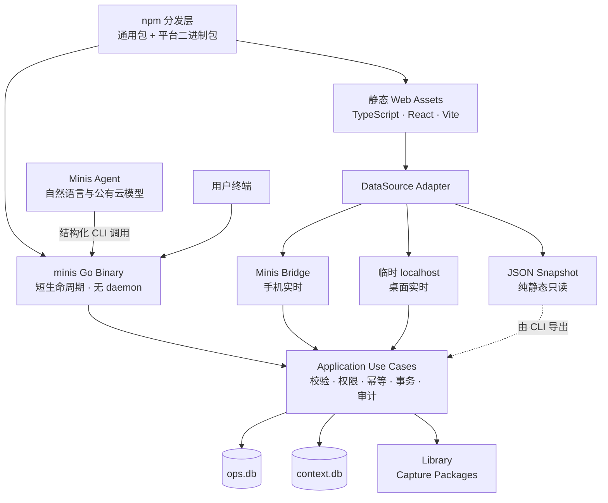

# Design：个人经营上下文系统 Go CLI 与静态前端技术架构

生成日期：2026-08-21  
状态：DRAFT（总体路线已确认，详细设计待确认）  
版本：0.1  
模式：Builder / 个人自用优先、产品化可分发  
关联设计：[个人经营上下文系统 B+](./个人经营上下文系统_B+_设计.md)  
范围：技术方案与协议设计，不包含代码、脚手架、数据库迁移或发布操作

## 1. 决策摘要

采用以下技术组合：

- **Go 原生二进制**作为唯一的确定性业务核心和 CLI。
- **npm** 作为安装、升级和多平台分发入口，不作为核心运行时。
- **TypeScript + React + Vite** 构建一份纯静态前端，不使用 SSR。
- **SQLite + Library 文件系统**保存全部持久状态；不引入常驻数据库服务。
- **无常驻进程**：每次 CLI 调用独立启动、打开所需数据、完成一次操作、关闭并退出。
- **三种前端数据适配器**：Minis Bridge、临时本地 HTTP、离线 Snapshot。
- **读取可以直达确定性视图，写入必须经过 Go 业务用例**；前端和 Agent 不直接拼接写入 SQL。
- **Python 保留为迁移、研究和可选扩展脚本**，不再承担核心业务规则。
- **公有云模型不嵌入 CLI 核心**。Minis Agent 负责理解自然语言，再调用确定性 CLI；CLI 只接收明确、可校验的结构化指令。

一句话架构：

```text
npm 负责把正确的 Go 二进制和静态网页送到设备；
Go CLI 负责一次性的确定性读写；
SQLite 与 Library 负责长期状态；
静态网页负责让用户看清楚和发起明确操作。
```

## 2. Problem Statement

当前系统已经验证了核心工作流：Python 脚本直接操作 SQLite，生成静态 `dashboard.html`，手机端查看结果，Agent 根据用户语言执行脚本。但脚本正在快速增加，存在以下产品化障碍：

1. 同一业务规则分散在 `today.py`、`do.py`、`dashboard.py`、迁移脚本和临时修复脚本中。
2. 写入入口缺少统一参数、错误码、幂等、并发版本检查和审计协议。
3. Agent 需要知道具体脚本名和数据库细节，无法稳定演化为通用产品能力。
4. Python 适合现阶段验证，但不利于形成快速启动、单文件、跨平台的最终 CLI。
5. 现有静态页面主要依赖预生成 HTML；未来要展示 `ops.db`、`context.db` 和 Library，需要统一的数据访问协议。
6. 手机 Minis、普通桌面浏览器和纯离线文件三种环境的文件权限不同，不能假设一份静态网页天然能读取任意本地 SQLite 文件。
7. 用户希望通过 npm 安装和升级，但又希望安装后执行的是高效率二进制，而不是长期依赖 Node 或 Python 解释器。

本设计解决的不是“换一种语言”，而是把已经验证的个人经营工作流收敛成一个稳定的本地产品运行边界。

### 2.1 What Makes This Cool

最有价值的体验不是“本地又运行了一个复杂系统”，而是用户几乎感觉不到运行时的存在：

- 一个 npm 安装命令交付正确平台的原生工具。
- Agent 每次只启动一个短命令，做完立即消失。
- 手机、桌面和离线导出看到的是同一套静态界面与同一套数据语义。
- 即使 npm 包、前端和 Agent 全部移除，SQLite、原始文件和 manifest 仍然完整、可读、可恢复。
- 后来接入健康和财务数据时，只扩展数据域与权限，不推翻分发和运行模型。

## 3. 目标与非目标

### 3.1 目标

1. 用户通过一个 npm 包完成安装、升级和卸载。
2. 安装后获得统一的 `minis` 命令。
3. 每个命令是短生命周期进程，不需要 daemon、队列服务或数据库服务器。
4. 同一个 Go 核心同时服务人类 CLI、Minis Agent、手机前端和临时本地网页。
5. 首批支持 iSH `linux/386` 与 macOS Apple Silicon；架构上兼容其他桌面平台。
6. 查询输出既适合人读，也有稳定的版本化 JSON 协议供 Agent 和前端使用。
7. 所有写入均支持校验、审计、并发冲突检测和幂等重试。
8. Library 文件写入即使中途崩溃，也能恢复或明确暴露为待修复状态。
9. 静态前端不绑定某一种数据通道，手机、桌面和导出版使用同一套 UI。
10. 数据结构和 CLI 可以独立升级，旧数据不能因升级而静默丢失。

### 3.2 非目标

- 第一阶段不提供常驻 Web 后端。
- 第一阶段不提供多用户协作和远程实时同步。
- 第一阶段不把 LLM SDK、模型供应商和 API Key 写进核心 CLI。
- 第一阶段不允许插件直接绕过领域层执行任意数据库写入。
- 第一阶段不让普通 Safari 网页直接打开和写入真实 SQLite 文件。
- 第一阶段不让前端依赖数据库内部表结构进行写入。
- 第一阶段不追求 Rust 级别的极限内存优化。
- 第一阶段不把健康和财务原始数据并入同一个数据库。

## 4. 已确认 Premises

1. **npm 是分发渠道，不是技术栈中心。** 核心可使用 Go，npm 包负责选择平台产物。
2. **“无状态”指进程无状态。** SQLite、Library、配置、迁移记录和审计事件是必要的持久状态。
3. **不常驻不等于没有进程。** `minis ui` 可以在用户主动运行期间提供临时本地访问，退出命令后立即消失。
4. **静态网页不能独立承担所有本地权限。** Minis 内嵌页依赖 Bridge；普通浏览器依赖临时本地适配器；离线页面依赖 Snapshot。
5. **写规则只能有一份。** Agent、CLI 和 UI 最终都调用同一组 Go Application Use Cases。
6. **SQLite 和 Library 是事实源。** HTML、JSON Snapshot、摘要和搜索索引都是可重建投影。
7. **手机仍是当前权威写入端。** Mac iCloud 目录继续按镜像和恢复来源处理，不能假装双向数据库客户端。
8. **首个关键平台是 iSH。** 语言和 SQLite 驱动必须先通过真实 `linux/386` 设备验证，再扩大平台范围。

## 5. Approaches Considered

### Approach A：Python 统一入口（最小可行）

- 工作量：S
- 风险：中
- 方式：整理现有 Python 脚本，增加统一入口和 npm 包装器。
- 优点：最快复用现有代码和真实业务规则。
- 缺点：最终仍依赖解释器，二进制分发、冷启动和跨平台一致性不理想。
- 复用：全部现有 `action_plan/*.py` 和 SQLite 逻辑。

### Approach B：Go 核心 + npm 分发 + 静态 UI（已选择）

- 工作量：M
- 风险：低到中
- 方式：Go 实现 CLI 和领域规则；npm 交付平台二进制；TypeScript 构建静态前端。
- 优点：符合二进制、短生命周期、跨平台、SQLite 和产品化要求。
- 缺点：需要迁移已有 Python 规则，并维护 Go DTO 与 TypeScript DTO 的协议一致性。
- 复用：现有 SQLite 结构、Python 业务语义、静态看板信息架构和 Library 设计。

### Approach C：Rust 核心 + npm 分发

- 工作量：L
- 风险：中到高
- 方式：Rust 实现全部核心能力并静态链接 SQLite。
- 优点：运行效率、内存控制和类型约束最强。
- 缺点：交叉编译、SQLite 链接、构建链和迭代复杂度超过当前需要。
- 复用：数据与产品模型可以复用，现有 Python 代码复用较少。

**选择：Approach B。** 只有真实 iSH 基准证明 Go 无法满足冷启动或内存预算时，才重新评估 Rust；不能因为理论性能提前支付 Rust 的复杂度。

## 6. 总体架构



### 6.1 四个边界

| 边界 | 责任 | 不允许 |
|---|---|---|
| Distribution | npm 安装、平台选择、版本和完整性 | 包含业务规则 |
| CLI Protocol | 参数、JSON 协议、退出码、帮助 | 暴露内部 SQL |
| Application Core | 业务校验、事务、权限、幂等、审计 | 依赖终端或 React |
| Adapters | SQLite、文件系统、Bridge、HTTP、Snapshot | 复制领域规则 |

## 7. 技术栈

### 7.1 Go 核心

建议第一阶段：

| 能力 | 选择 | 原因 |
|---|---|---|
| 语言 | Go | 单二进制、跨平台、冷启动、标准库完整 |
| CLI 参数 | Cobra | 子命令、帮助、补全和稳定生态；也可在实现前用小型 spike 验证二进制体积 |
| SQLite 抽象 | `database/sql` | 标准接口，便于测试和替换驱动 |
| SQLite 驱动 | `modernc.org/sqlite` | CGo-free，支持 `linux/386`，便于 iSH 分发 |
| ID | ULID | 可按时间排序，适合 Capture、Event、Request |
| 配置 | JSON | 与 manifest、前端和现有数据风格一致，避免额外解析体系 |
| 日志 | `log/slog` | 标准库结构化日志 |
| 内嵌资源 | `embed` | 打包 migrations、JSON Schema 和静态网页 |
| 协议定义 | JSON Schema | CLI、Bridge、HTTP、Snapshot 共用 |

SQLite 驱动必须被隔离在 Adapter 层。若真实设备测试表明 pure-Go SQLite 在 iSH 的内存或速度不可接受，可以为 iSH 构建静态 musl SQLite 变体，而不改变领域层与命令协议。

### 7.2 静态前端

| 能力 | 选择 | 原因 |
|---|---|---|
| 语言 | TypeScript | 明确 DTO 和适配器契约 |
| UI | React | 与自然语言生成前端和现有生态兼容 |
| 构建 | Vite | 输出普通静态资源，无 SSR 依赖 |
| 路由 | Hash Router | 支持 `file://`、内嵌 WebView 和无重写规则的本地服务 |
| 状态 | React 内置状态 + 小型 Query Cache | 第一阶段避免引入全局状态框架 |
| 样式 | CSS Variables + 轻量组件层 | 保留未来主题和手机适配，不绑定大型运行时 |
| 协议 | 由 JSON Schema 生成或校验的 TypeScript 类型 | 防止 Go 与 UI 契约漂移 |

前端输出只有：

```text
web-dist/
├── index.html
├── assets/
├── protocol-schema.json
└── build-info.json
```

它可以被 Go binary 内嵌，也可以作为普通静态目录随 npm 包交付。

### 7.3 Python 的保留边界

Python 继续适合：

- 一次性旧库盘点和迁移验证
- PDF/OCR/数据科学等外围处理
- 快速验证尚未稳定的算法
- 用户自定义的个人脚本

Python 不再直接修改生产库。需要产生正式写入时，应调用 `minis ... --json`，或生成待确认的结构化输入交给 Go CLI。

## 8. 安装目录与数据目录

### 8.1 可执行程序与数据分离

npm 安装目录只放可替换的软件：

```text
node_modules/@minis/context/
├── bin/
├── web-dist/
├── schemas/
└── package.json
```

用户数据放在独立的 `MINIS_ROOT`，升级 npm 包不能覆盖数据：

```text
MINIS_ROOT/
├── system/
│   ├── config.json
│   ├── install.json
│   ├── migrations/
│   ├── staging/
│   └── recovery/
├── data/
│   ├── ops.db
│   ├── context.db
│   ├── health.db        # 以后
│   └── finance.db       # 以后
├── library/
│   ├── YYYY/MM/DD/cap_.../
│   └── _system/
├── snapshots/
├── exports/
└── logs/
```

iSH 默认根目录建议为 `/var/minis/shared`。现有 `/var/minis/shared/action_plan` 作为迁移来源，不直接改造成新目录。

### 8.2 Root 解析顺序

每次命令按固定顺序寻找数据根目录：

1. 全局参数 `--root <path>`
2. 环境变量 `MINIS_ROOT`
3. 当前目录向上找到的 `.minis-root.json`
4. `system/install.json` 登记的默认实例
5. 平台默认值；iSH 为 `/var/minis/shared`

命令返回结果必须包含实际使用的 `root`，防止 Agent 或用户误操作另一个数据实例。

### 8.3 配置原则

- `system/config.json` 只保存非秘密配置。
- API Key、令牌和账户凭据不写入 Library、SQLite 或普通配置文件。
- 路径在读取后立即规范化；所有内部记录使用相对 `MINIS_ROOT` 的路径。
- 配置包含 `instance_id`、时区、语言、数据库路径、Library 路径、日志模式、前端能力和隐私默认值。
- `minis init` 幂等；重复执行只报告现状，不覆盖已有数据。

## 9. 无常驻进程的命令生命周期

每次调用都执行同一套生命周期：

```text
解析参数
  → 定位 MINIS_ROOT
  → 加载最少必要配置
  → 校验 CLI / schema 兼容性
  → 只打开本命令需要的数据库和目录
  → 执行查询或短事务
  → 写审计/幂等结果
  → 输出 text 或 JSON
  → 关闭句柄并退出
```

约束：

- 不把数据库连接、缓存或任务队列留给下一次进程。
- 不在后台 fork、注册服务或自动保持端口。
- 查询命令以只读方式打开数据库。
- 写命令只在必要区间持有写锁。
- 长耗时导入可以让当前命令持续运行，但不能偷偷转入后台。
- 若未来需要异步工作，使用持久 `jobs` 表和显式 `minis jobs run` 拉取执行；仍不要求 daemon。第一阶段不实现。

## 10. CLI 信息架构

### 10.1 命名原则

统一形式：

```text
minis <domain> <resource> <verb> [arguments]
```

简短高频命令允许别名，但 JSON 返回中的 `command` 始终使用规范全名。

### 10.2 全局参数

| 参数 | 作用 |
|---|---|
| `--root` | 明确数据实例 |
| `--format text\|json\|ndjson` | 输出模式 |
| `--request-id` | Agent 重试幂等键 |
| `--actor` | `user/agent/ui/migration/system` |
| `--timeout` | 获取数据库锁和网络操作的上限 |
| `--dry-run` | 返回将发生的变化，不提交 |
| `--trace` | 输出本地诊断信息，不包含敏感正文 |
| `--no-color` | 稳定终端和自动化输出 |

所有命令都支持 `--help` 和 `--version`。复杂输入优先通过 `--input <json-file>` 或标准输入传递，避免 shell 引号破坏中文、Markdown 和长文本。

### 10.3 第一阶段命令面

#### 系统

```text
minis init
minis version
minis doctor
minis schema status
minis schema plan
minis schema migrate
minis backup create
minis backup verify
minis verify
```

#### 经营执行

```text
minis ops status
minis task list|get|create|update|complete|reschedule|pause|resume
minis task set-review
minis project list|get|create|update|pause|archive
minis project link-kr
minis schedule day|week
minis event list
```

#### 上下文与收件箱

```text
minis context search
minis context entity list|get
minis context evidence show
minis inbox list|get|triage|set-review|archive
minis context link
```

#### Library

```text
minis library capture
minis library item list|get
minis library item add-version
minis library component promote
minis library link
minis library bundle create|add|remove|get
minis library verify
```

#### 前端

```text
minis ui info
minis ui serve
minis ui export
```

`minis ui` 可作为 `minis ui serve` 的人类友好别名；规范命令名仍记录为 `ui.serve`。

### 10.4 写命令规则

- 写入必须使用稳定 ID；标题关键词只允许用于搜索，不能直接决定写入对象。
- 搜索命中多条时返回候选并以冲突退出，不进入交互猜测。
- 更新现有对象必须携带 `expected_version`；人工终端可以先读后写，Agent 不得跳过。
- 高风险动作必须携带明确确认参数；批量操作必须支持 `--dry-run`。
- 每个写命令都产生领域事件和 `command_request` 记录。
- 同一 `request_id + payload_hash` 重试时返回第一次结果，不重复执行。
- 同一 `request_id` 携带不同 payload 时返回幂等冲突。

CLI 不做用户没有要求的语义判断：

- `ops status` 展示容量、冲突和事实，不替用户重排优先级。
- Library Capture 如果没有明确 `item_plan`，先封存原件并进入待分类状态，不擅自把多个文件拆成长期 Item。
- Agent 可以根据上下文提出结构化 `item_plan`，但高影响分类、任务创建和日期承诺仍遵循用户确认规则。

## 11. CLI JSON 协议

### 11.1 成功信封

```json
{
  "protocol": "minis-cli/v1",
  "ok": true,
  "command": "task.reschedule",
  "request_id": "01J...",
  "data": {},
  "changes": [],
  "warnings": [],
  "meta": {
    "root": "/var/minis/shared",
    "cli_version": "0.1.0",
    "schema_versions": {"ops": 2, "context": 1},
    "duration_ms": 42
  }
}
```

### 11.2 错误信封

```json
{
  "protocol": "minis-cli/v1",
  "ok": false,
  "command": "task.reschedule",
  "request_id": "01J...",
  "error": {
    "code": "VERSION_CONFLICT",
    "message": "Task has changed since it was read",
    "details": {},
    "retryable": false
  },
  "meta": {}
}
```

### 11.3 输出纪律

- `stdout` 只输出最终 text/JSON/NDJSON 数据。
- 日志、进度和诊断写入 `stderr`。
- JSON 模式禁止混入 emoji、进度条或提示语。
- 字段只能向后兼容地增加；删除或改变语义需要升级 protocol major version。
- 时间使用 RFC 3339 并包含时区；自然日单独用 `YYYY-MM-DD`。
- 金额使用整数最小货币单位或明确 decimal string，不使用浮点。
- ID 永远以字符串传输。

### 11.4 退出码

| 退出码 | 含义 |
|---:|---|
| 0 | 成功 |
| 2 | 参数或输入格式错误 |
| 3 | 对象不存在 |
| 4 | 命中歧义或版本冲突 |
| 5 | CLI 与 schema 不兼容 |
| 6 | 数据库忙或资源锁超时 |
| 7 | 权限、隐私策略或确认不足 |
| 8 | 完整性校验失败 |
| 9 | 外部网络或来源获取失败 |
| 10 | 操作未完整结束，需要恢复 |

Agent 首先判断退出码和 `error.code`，不能通过解析自然语言错误信息决定下一步。

## 12. Application Core 设计

### 12.1 分层

```text
Command / Bridge / HTTP
        ↓
Input DTO Validation
        ↓
Application Use Case
        ↓
Domain Rules
        ↓
Repository / File / Clock / ID Ports
        ↓
SQLite / Library / OS Adapters
```

领域层不得引用：

- Cobra
- HTTP request/response
- React 或 WebView
- 具体 SQLite 驱动类型
- 公有云模型 SDK

这样 `task.reschedule` 无论来自终端、Agent、Bridge 还是临时网页，都执行同一份规则。

### 12.2 建议逻辑模块

| 模块 | 责任 |
|---|---|
| `system` | init、doctor、版本、配置、备份 |
| `ops` | Area、Initiative、Project、Task、Schedule、Event |
| `context` | Source、Inbox、Entity、Fact、Evidence、Relation |
| `library` | Capture、Item、Version、Component、Asset、Bundle |
| `policy` | 敏感度、cloud policy、确认和权限 |
| `protocol` | DTO、JSON Schema、错误码和兼容性 |
| `projection` | UI 只读视图与 Snapshot |

### 12.3 模型调用边界

核心 CLI 不负责“判断用户想做什么”。固定链路为：

```text
用户自然语言
  → Minis Agent / 公有云模型理解
  → 本地只读 CLI 获取确定性上下文
  → Agent 形成明确的结构化变更
  → 必要时让用户确认
  → 调用写 CLI
  → CLI 独立校验并提交
```

即使 Agent 已经确认，CLI 仍要检查枚举、版本、权限、幂等和业务约束。模型输出永远不是可信数据库指令。

## 13. SQLite 访问与事务

### 13.1 连接策略

- 一个 CLI 调用只创建本命令所需连接。
- 查询使用只读连接；写入使用单一短事务。
- 每个连接开启 `foreign_keys`。
- 设置有限 `busy_timeout`，超时返回明确可重试错误。
- 前端查询不得长期持有 cursor 或 transaction。
- 不跨 `ops.db` 与 `context.db` 建立外键。
- 不依赖跨数据库原子事务；跨域关系使用稳定全局 ID 和可恢复工作流。

### 13.2 Journal 模式

第一阶段不在设计文档中武断固定 WAL 或 DELETE：

- WAL 更适合前端多读与 CLI 短写并存。
- DELETE journal 的文件集合更简单，对某些镜像和恢复流程更直观。
- iSH 的文件锁、mmap、共享内存和 iCloud 镜像行为需要真实设备验证。

最终模式由 `minis doctor storage` 的资格测试决定，并写入实例配置。无论选择哪种模式，对外同步都使用 SQLite Backup API 或等价的一致性快照，不能复制一个可能正在写入的活跃数据库。

### 13.3 Schema 兼容

每个数据库保存：

- `schema_version`
- `migration_history`
- `application_id`
- `created_by_version`
- `last_migrated_by_version`

每个 CLI binary 声明可读写的 schema 范围：

- 兼容：正常运行。
- 数据库过旧：只读命令可以报告；写命令拒绝，并要求显式迁移。
- 数据库过新：所有写入拒绝，避免旧 binary 破坏新结构。

迁移规则：

1. `minis schema plan` 只展示变更和风险。
2. `minis schema migrate` 先创建一致性快照和校验值。
3. migration 必须可重复检测，但不要求支持危险的自动 down migration。
4. 失败后通过快照恢复，不在损坏状态上继续尝试。
5. npm 安装和更新本身不自动修改用户数据库。

### 13.4 跨数据库操作

“从 Inbox 创建 Task”会同时影响 `context.db` 和 `ops.db`。系统不依赖两个独立 SQLite 文件之间的隐藏原子性，而采用幂等、可恢复的本地 Saga：

```text
1. 生成统一 operation_id、request_id 和目标 task_id
2. context.db：登记 cross_domain_operation=prepared
3. ops.db：以 request_id 幂等创建 Task，并写 created_from 引用
4. context.db：创建 domain_link，Inbox 标记已创建行动
5. cross_domain_operation=completed
```

如果步骤 3 后崩溃，恢复程序用预先生成的 `task_id/request_id` 查询 `ops.db`，补建 link，而不是再次创建任务。任何超过恢复窗口仍未完成的操作进入 `v_cross_domain_incomplete`，在 UI 和 `doctor` 中可见。

跨库命令必须明确一个主域：

- Inbox → Task：`context.db` 是协调主域。
- Task 关联资料：`ops.db` 完成 Task 变更后，`context.db` 记录关系。
- 删除或归档跨域对象：只改变本域生命周期，不级联物理删除另一域对象。

## 14. 幂等、并发和审计

### 14.1 幂等记录

每个可写数据库维护 `command_requests`：

- `request_id`
- `command_name`
- `payload_hash`
- `actor`
- `started_at/completed_at`
- `status`
- `result_json`
- `error_code`

Agent 每次产生外部可见写入时都传入 `request_id`。网络重试、模型重试或终端重复执行不会生成重复任务或重复 Capture Package。

### 14.2 乐观并发

可编辑对象维护整数 `version`：

```text
读取 Task version=7
  → 用户决定改期
  → 写入携带 expected_version=7
  → 当前仍为 7：更新为 8
  → 当前已为 8：拒绝并返回最新状态
```

系统禁止 last-write-wins 静默覆盖。

### 14.3 审计

领域事件至少记录：

- 谁发起：user/agent/ui/migration/system
- 通过什么入口：cli/bridge/http/import
- 何时发生
- 对象与版本
- 变更前后摘要
- request ID
- 原因或用户说明
- 是否经过明确确认

敏感正文不进入通用日志；审计保留对象 ID 和必要摘要。

## 15. Library 文件事务

SQLite 事务无法直接覆盖文件复制，因此 Library 使用“可恢复提交”，而不是假装数据库和文件系统天然原子。

### 15.1 Capture 提交流程

```text
1. 生成 request_id / capture_batch_id / capture_package_id
2. 将输入复制到同一文件系统的 system/staging/<id>
3. 校验路径、大小、MIME，计算每个 Asset 哈希
4. 写不可变 manifest 临时文件并 fsync
5. context.db 短事务写入 staging 状态元数据和 operation journal
6. 原子 rename 到 library/YYYY/MM/DD/cap_<id>
7. context.db 短事务把 Package/Version/Assets 标记为 sealed
8. 返回 Item、Version、Asset 和最终路径
```

### 15.2 崩溃恢复矩阵

| 数据库状态 | staging | final | 恢复动作 |
|---|---:|---:|---|
| 无记录 | 有 | 无 | 放入 orphaned，等待确认或安全清理 |
| staging | 有 | 无 | 校验后继续 rename |
| staging | 无 | 有 | 校验 manifest 后完成 sealed |
| sealed | 无 | 有 | 正常 |
| sealed | 无 | 无 | 高优先级完整性错误，不自动伪造文件 |
| 无记录 | 无 | 有 | 从 manifest 重建基础索引，进入待确认 |

`minis library verify` 和 `minis doctor` 执行这些对账，但不会在没有依据时删除用户文件。

### 15.3 文件安全

- 输入路径必须规范化，防止 `..` 和符号链接逃逸。
- 导入是复制原始字节，不把外部源路径当成长期事实源。
- Library API 使用 `asset_id`，不接受前端传来的任意绝对路径读取请求。
- 压缩包第一阶段只登记和预览目录，不默认解压执行。
- HTML、SVG 和代码预览使用隔离策略，不能直接获得 Bridge 权限。
- 敏感度和 `cloud_policy` 在捕获时继承到 Item/Asset，后续可人工收紧。

## 16. 静态前端架构

### 16.1 DataSource 契约

React 组件只依赖统一接口：

```text
DataSource
├── query(operation, input)
├── mutate(operation, input, request_id)
├── getAsset(asset_id, preview_mode)
├── capabilities()
└── subscribe(optional)
```

同一操作名与 CLI JSON `command` 一致，例如：

- `ops.status`
- `task.list`
- `task.reschedule`
- `inbox.triage`
- `library.item.get`
- `library.list_by_date`

组件不得知道数据库文件路径、表名和 SQL。

三种 Adapter 共享一份 Invocation Request：

```json
{
  "protocol": "minis-invoke/v1",
  "operation": "task.reschedule",
  "request_id": "01J...",
  "actor": "ui",
  "input": {
    "task_id": "task_...",
    "expected_version": 7,
    "new_date": "2026-08-26",
    "reason": "本周容量不足"
  }
}
```

返回值复用 CLI JSON 信封。不同传输只负责搬运同一份请求：

- Bridge：`invoke(request)`。
- localhost：`POST /api/v1/invoke`。
- CLI：复杂命令从 `--input` 或 stdin 读取 request/input。
- Snapshot：只实现查询结果读取，不接受 Invocation Request。

localhost 另外只暴露 `GET /api/v1/capabilities`、`GET /api/v1/health` 和按 ID 读取的 `GET /api/v1/assets/<asset_id>`。不为每张数据库表建立 CRUD HTTP API，也不提供通用 SQL endpoint。

### 16.2 Adapter A：Minis Bridge

用于手机内嵌静态页面，是主要体验：

- Bridge 提供 `query`、`mutate`、`getAsset`、`capabilities`。
- 只读查询可以映射到确定性 SQLite views。
- 写入由 Bridge 调用 Go Application Use Case；不能让 JavaScript 执行任意写 SQL。
- Asset 通过受控 URL、临时句柄或字节流访问。
- Bridge 每次返回 protocol version 和 schema version。
- 页面启动先读取 capabilities，按设备能力隐藏不支持操作。

若现有 Minis Bridge 第一阶段只能读 SQLite，则手机前端先保持只读；写入继续由 Agent/CLI 完成，不能为了赶进度复制写入规则到 JavaScript。

### 16.3 Adapter B：临时 localhost

`minis ui serve` 用于普通桌面浏览器：

- 绑定 `127.0.0.1` 随机端口，不监听局域网地址。
- 前台运行，Ctrl-C、父进程结束或空闲超时即退出。
- 静态资源从 Go binary 的内嵌文件提供。
- 默认只读；显式 `--allow-write` 才开放 mutation。
- 启动时生成随机 session token；前端用自定义 Header 携带。
- 校验 Origin、Host 和 token，拒绝通配 CORS。
- Asset 只能按 ID 获取，服务端解析真实路径并再次校验根目录。
- 不提供任意文件浏览或任意 SQL endpoint。

它是用户主动打开期间的临时适配器，不是需要部署、运维和常驻的传统后端。

### 16.4 Adapter C：离线 Snapshot

`minis ui export` 生成：

```text
export_<timestamp>/
├── index.html
├── assets/
├── snapshot.json
├── snapshot-manifest.json
└── previews/              # 按策略可选
```

规则：

- Snapshot 只读，页面明显显示生成时间。
- 默认不复制 restricted/sensitive 原文。
- 数据包含来源数据库校验值、schema、协议版本和过滤条件。
- Snapshot 可以删除并重新生成，不成为新的事实源。
- 如果用户需要单文件 HTML，可作为额外导出模式，不作为内部标准格式。

### 16.5 能力矩阵

| 能力 | Minis Bridge | localhost | Snapshot |
|---|---:|---:|---:|
| 实时查询 | 是 | 是 | 否 |
| 查看 Library 原文 | 是 | 是 | 按导出策略 |
| 写入 | 通过受控 Use Case | 默认否，可显式开启 | 否 |
| 后台服务 | 无 | 无常驻，仅前台 | 无 |
| 普通浏览器可用 | 否 | 是 | 是 |
| 离线分享 | 否 | 否 | 是 |

## 17. 前端读取模型

UI 不读取原始表，而读取版本化 Projection：

```text
v_ui_today
v_ui_week
v_ui_projects
v_ui_inbox
v_ui_library_by_date
v_ui_library_item_detail
v_ui_data_quality
```

每个 projection DTO 明确：

- `projection_version`
- `generated_at`
- 数据库 schema version
- 是否实时或 Snapshot
- 结果范围和分页 cursor
- 数据质量 warnings

这能让数据库内部结构继续演进，而不迫使前端与每张表同步变化。

### 17.1 刷新策略

- Bridge/HTTP：页面聚焦、明确写入成功或用户下拉时重新查询。
- 第一阶段不实现实时数据库订阅。
- 写入响应直接返回最新对象和受影响 projection keys，前端只刷新相关区域。
- Snapshot：不刷新，只提示重新导出。

### 17.2 大型 Library 浏览

- 列表只返回元数据和缩略图定位，不返回原文件字节。
- 正文、PDF、音频和图片按需加载。
- 分页使用稳定 cursor，不使用会因插入而漂移的 offset 作为唯一机制。
- 图片联系人表、OCR 和文本预览属于可重建派生内容。

## 18. npm 分发设计

### 18.1 包结构

建议包名暂定：

```text
@minis/context                  通用入口、JS fallback launcher、静态资源和 schemas
@minis/context-darwin-arm64
@minis/context-darwin-x64
@minis/context-linux-ia32
@minis/context-linux-x64
@minis/context-linux-arm64
@minis/context-win32-x64        后续
```

平台包只包含对应二进制、LICENSE 和 build metadata。通用包通过精确版本的 `optionalDependencies` 获取对应平台包。

### 18.2 安装和启动

1. npm 根据 `os/cpu` 安装匹配的平台包。
2. 通用 launcher 找到平台 binary，校验版本一致。
3. POSIX 平台可在安装阶段物化一个直接执行入口，减少每次 Node 启动开销。
4. 如果安装脚本被禁用，JS fallback launcher 仍能查找并执行 binary。
5. 不在 postinstall 中从任意 URL `curl` 二进制；所有执行文件必须来自 npm tarball。

首轮设备测试要分别测量：

- 直接 native binary
- npm 生成的 `minis` 命令
- `npx @minis/context`

如果 JS fallback 在 iSH 增加明显冷启动延迟，正式安装路径必须使用直接 native shim；`npx` 只作为首次体验入口。

### 18.3 平台矩阵

| 平台 | Go target | npm os/cpu | 第一阶段 |
|---|---|---|---:|
| Minis / iSH | `linux/386` | `linux/ia32` | 必须 |
| macOS Apple Silicon | `darwin/arm64` | `darwin/arm64` | 必须 |
| macOS Intel | `darwin/amd64` | `darwin/x64` | 建议 |
| Linux x64 | `linux/amd64` | `linux/x64` | 建议 |
| Linux ARM64 | `linux/arm64` | `linux/arm64` | 后续 |
| Windows x64 | `windows/amd64` | `win32/x64` | 后续 |

由于核心构建使用 CGo-free，Linux binary 不依赖目标机 glibc/musl 动态库；但 iSH 的系统调用实现仍必须实机验证。

### 18.4 版本和升级

- 通用包和所有平台包使用完全相同版本号。
- 遵循 SemVer：CLI protocol major、数据库 schema、前端 projection 分开记录。
- `minis version --json` 返回 CLI、Git commit、build target、Go version、SQLite version、web build 和兼容 schema 范围。
- `npm update -g` 只替换软件；不会自动迁移数据库。
- 新 binary 首次运行若发现需要迁移，只报告计划并拒绝写入，直到用户执行 `minis schema migrate`。
- 不支持的旧 binary 遇到新数据库时必须安全拒绝，而不是尝试降级数据。

### 18.5 供应链

- 每个平台产物生成 SHA-256 和 SBOM。
- npm 发布使用 provenance；平台包版本用精确依赖，不使用宽松范围。
- 构建产物在发布前执行 `version`、只读 SQLite、写事务和 Library capture smoke test。
- macOS 分发根据真实 Gatekeeper 行为决定是否需要签名与 notarization。
- 安装器不执行网络下载、数据库迁移或用户目录扫描。

## 19. 建议仓库结构

这是逻辑结构，不代表本轮创建文件：

```text
repo/
├── cmd/minis/                    # 唯一 Go 入口
├── internal/
│   ├── system/
│   ├── ops/
│   ├── context/
│   ├── library/
│   ├── policy/
│   ├── protocol/
│   ├── projection/
│   └── adapters/
│       ├── sqlite/
│       ├── filesystem/
│       ├── bridge/
│       ├── httpui/
│       └── snapshot/
├── migrations/
│   ├── ops/
│   └── context/
├── schemas/                      # JSON Schema / protocol
├── web/
│   ├── src/
│   └── tests/
├── npm/
│   ├── universal/
│   └── platform-packages/
├── testdata/
│   ├── legacy/
│   ├── fixtures/
│   └── crash-recovery/
└── docs/
```

领域包按业务能力组织，而不是建立一个巨大的 `services` 或 `utils` 目录。

## 20. 安全与隐私

### 20.1 默认安全姿态

- CLI 默认只操作解析后的单个 `MINIS_ROOT`。
- Web 临时服务默认只读、仅 localhost、随机 token。
- Snapshot 默认排除 sensitive/restricted 原文。
- Agent 获得最少必要的查询结果，不获得整库和全量 Library。
- 对外发送、发布、删除、付款和批量覆盖继续要求单独确认。
- `--trace` 也不能打印原始健康、财务、合同正文或凭据。

### 20.2 数据库和文件输入

- 外部 SQLite 文件按不可信输入处理，不自动加载扩展。
- SQL 查询只允许编译在代码中的参数化语句和批准的 projection。
- 所有文件预览按 MIME 与实际内容共同判断，不能只相信扩展名。
- 压缩包防止路径穿越、压缩炸弹和可执行内容误运行。
- HTML 预览使用严格 CSP 和 sandbox，不继承应用 Bridge 权限。

## 21. 可观察性与 Doctor

默认无遥测。所有诊断留在本地。

`minis doctor` 检查：

- binary 与 schema 兼容性
- 数据根目录解析结果和权限
- SQLite foreign key、integrity check、journal 与锁能力
- context/ops 版本和 migration 状态
- Library manifest、哈希、orphan、staging 和 final 对账
- Snapshot 可创建与恢复
- 静态 Web 资源和 protocol version
- iSH 架构、可执行权限和文件系统能力

输出分为：

- `pass`：可正常使用
- `warn`：不阻塞，但需要关注
- `fail`：对应能力必须停止
- `repairable`：可以生成修复计划，但不自动执行破坏性修复

## 22. 性能预算

这些是第一阶段验收预算，不是未经实测的承诺：

| 场景 | iSH 目标 | 桌面目标 |
|---|---:|---:|
| `minis version --format json` 冷启动 | p95 ≤ 500 ms | p95 ≤ 100 ms |
| 今日状态，1 万任务规模 | p95 ≤ 1 s | p95 ≤ 250 ms |
| 单任务短事务写入 | p95 ≤ 1 s | p95 ≤ 250 ms |
| Library 列表首屏 | p95 ≤ 1 s | p95 ≤ 300 ms |
| 本地 UI 首次可见 | ≤ 2 s | ≤ 1 s |
| npm 单平台压缩下载 | ≤ 25 MB | ≤ 25 MB |
| CLI 峰值内存（普通命令） | ≤ 96 MB | ≤ 128 MB |

照片复制、PDF 解析、仓库归档等耗时命令单独显示进度，不纳入普通短命令预算。若 iSH 未达到目标，先分析 Node launcher、SQLite 驱动、文件系统和 syscall 模拟的占比，不能直接推断是 Go 语言问题。

## 23. 测试策略

### 23.1 核心测试

- 领域规则单元测试：不连接真实数据库。
- SQLite repository 集成测试：真实临时数据库、foreign key 和事务。
- CLI golden tests：text、JSON、错误码和退出码。
- JSON Schema contract tests：Go 输出与 TypeScript 类型一致。
- migration fixtures：每个历史 schema 都能升级并对账。
- idempotency tests：重复 request 不重复写入。
- optimistic concurrency tests：旧版本写入必定失败。

### 23.2 Library 故障测试

在 Capture 的每个步骤注入中断：

- 复制中断
- manifest 写入中断
- 第一次 DB commit 后中断
- rename 后中断
- sealed 前中断

每种状态都必须被 `verify/doctor` 正确识别，并能恢复或明确隔离；不能静默丢失原件。

### 23.3 前端契约测试

同一组 DataSource 测试分别运行在：

- Bridge mock
- localhost adapter
- Snapshot adapter

除能力差异外，同一 query 必须产生语义一致的 DTO。

### 23.4 平台测试

- macOS ARM64 自动化测试
- Linux AMD64 自动化测试
- Linux 386 构建与模拟 smoke test
- 真实 iPhone/iSH 手工发布门禁
- 后续增加 macOS x64、Linux ARM64、Windows x64

真实 iSH 门禁至少覆盖：启动、读库、写事务、锁冲突、中文路径、10 张照片 Capture、备份和恢复。

## 24. 发布流水线

```text
合并到发布分支
  → 单元/集成/契约/迁移测试
  → 构建平台 binaries
  → 构建静态 web-dist
  → 注入统一 build metadata
  → 各平台 smoke test
  → 生成 checksum + SBOM
  → 真实 iSH 候选版本验证
  → 发布平台 npm packages
  → 最后发布通用 npm package
  → 安装验证与回滚窗口
```

平台包必须先发布，通用包最后发布，避免用户安装到一个引用尚不存在 binary 的版本。

发布失败时撤回通用包或发布补丁版本；已经发布且可能被使用的版本不复写相同版本号。

## 25. 分阶段实施顺序

本节只是未来实施顺序，本轮不执行。

### Phase 0：真实设备技术 Spike

- 确认 iSH 的 `uname`、Node arch、npm 版本和文件系统能力。
- 验证 Go `linux/386` binary 启动。
- 验证 pure-Go SQLite 查询、事务、foreign key 和锁。
- 对比直接 binary 与 npm launcher 冷启动。
- 验证同卷 staging → final 原子 rename。

通过条件：关键能力全部可用；否则只调整 Adapter/分发方案，不推翻领域模型。

### Phase 1：只读 CLI 骨架

- 统一 root/config/version/protocol/error。
- 只读打开当前测试库。
- 实现 `version/doctor/ops status/task list`。
- 建立 golden JSON 和真实任务样本。

### Phase 2：`ops.db v2` 与写入协议

- migration framework。
- task/project/schedule 基础写用例。
- expected_version、request_id、events、backup。
- 用现有 10 条真实任务验收。

### Phase 3：Library Capture

- staging、manifest、hash、sealed、recovery。
- Capture Package / Item / Version / Asset 基础元数据。
- 会议 10 张照片、邮件附件、多分册方案、代码包四类样本。

### Phase 4：静态前端

- 先实现 Snapshot adapter，验证纯静态 UI。
- 再实现 localhost adapter，验证实时查询。
- 最后对接 Minis Bridge，手机端先只读再开放受控写入。

### Phase 5：npm 正式分发

- 平台包和通用包。
- 升级、旧 binary 拒绝新 schema、安装脚本禁用 fallback。
- 实际执行安装、升级、卸载但保留数据的验收。

### Phase 6：迁移与切换

- Python 旧系统只读冻结。
- 数据迁移与逐条对账。
- Go CLI 成为唯一正式写入口。
- Python 仅保留迁移和外围处理。

## 26. Success Criteria

1. `npm install -g` 后无需额外安装 Go、Python 或 SQLite 即可运行核心命令。
2. iSH 与 macOS 使用同一 CLI protocol 和业务规则。
3. 没有 daemon、开机服务或必须长期保持的 localhost 端口。
4. 任意命令执行后进程退出，未关闭的数据库句柄和 staging 状态可被检测。
5. Agent 重试同一 request 不会重复创建任务、事件或资料包。
6. 前端与 Agent 并发更新不会静默覆盖。
7. 前端组件不包含 SQL，不知道数据库物理路径。
8. Bridge、localhost 和 Snapshot 三种模式展示相同语义的数据。
9. npm 升级不会自动迁移或覆盖用户数据。
10. Library Capture 在任一中断点后都能恢复、重建或暴露为明确错误。
11. 数据库和 Library 可以从一致性 Snapshot 与 manifest 完成恢复演练。
12. 普通命令达到性能预算，或能用实测明确定位未达标层。

## 27. Dependencies

- Minis 当前 Bridge 的真实 API、权限和能否调用本地二进制。
- iSH 实际架构、Alpine 版本、文件锁和原子 rename 行为。
- `ops.db v2` 与 `context.db` 最终 schema。
- npm scope 与正式包名。
- 第一阶段支持的平台清单。
- 当前手机端静态前端的构建方式和资源加载方式。
- iCloud 镜像对 SQLite snapshot、Library 文件和大文件的同步行为。

## 28. Open Questions

这些问题不改变 Go 主路线，但在实现前需要关闭：

1. Minis Bridge 当前是直接执行 SQL、调用 Python，还是已有通用 command invoke 接口？
2. Bridge 是否能安全调用 `minis` binary 并返回 stdout/exit code？
3. 手机前端第一阶段是否必须支持写入，还是先只读、由 Agent 写入？
4. 正式命令名使用 `minis`、`minis-context` 还是产品新名称？
5. npm scope 是否可用，是否需要同时提供非 scoped 包？
6. iSH 上 Node/npm 的架构值是否稳定报告为 `ia32`？
7. 第一阶段是否必须支持 Windows？建议不阻塞 iSH/macOS 首发。
8. active database 的 journal mode 在真实设备测试后选 WAL 还是 DELETE？
9. Library 单文件和单次 Capture 的体积阈值是多少？
10. localhost 模式第一阶段是否只读？建议默认只读。
11. 模型派生任务由 Agent 同步完成，还是以后增加显式 `jobs` 表？
12. 静态 UI 是否沿用现有视觉方案，还是在协议稳定后单独设计？

## 29. The Assignment

进入任何实现之前，只做一次真实设备资格确认，记录以下结果：

```text
uname -a
uname -m
node -p process.platform
node -p process.arch
npm --version
python3 --version
SQLite 版本
/var/minis/shared 文件系统上的 rename 与锁测试结论
```

随后用同一个候选 Go binary 在真实 iSH 完成四个基准：空启动、SQLite 只读、SQLite 短写、10 张照片复制与哈希。这份结果将决定 SQLite Adapter 和 npm launcher 的最终实现细节，但不改变已经确认的总体架构。

## 30. What I Noticed

用户提出的“无状态、快速启用、像 Serverless”并不是要求把系统搬到云端，而是反对为了一个人的本地经营系统引入需要维护的后台服务。真正适合的技术边界是：程序可以随时消失，数据和审计不能消失。

用户同时要求 npm 分发与高效二进制，这两个要求并不冲突。npm 是成熟的安装入口，Go 是更适合 iSH 和 SQLite 的执行载体；把两者强行统一成 TypeScript 运行时反而会牺牲核心目标。

现有 Python 脚本不是应被丢弃的旧实现，而是已经发生过真实业务使用的行为样本。迁移重点不是逐行翻译 Python，而是从这些脚本中提取已经被用户验证的命令语义、约束和事件记录方式，再由 Go 建立唯一正式入口。

## 31. References

- [npm `package.json` 的 `bin`、`os`、`cpu` 与 `libc`](https://docs.npmjs.com/cli/v11/configuring-npm/package-json/)
- [iSH：iOS 上的用户态 x86 模拟与 Alpine 环境](https://github.com/ish-app/ish/blob/master/README.md)
- [Go 支持的 GOOS/GOARCH](https://go.dev/doc/install/source#environment)
- [modernc.org/sqlite：CGo-free 与 linux/386 支持](https://pkg.go.dev/modernc.org/sqlite)
- [SQLite Is Serverless](https://www.sqlite.org/serverless.html)
- [SQLite 作为应用文件格式](https://www.sqlite.org/appfileformat.html)
- [WebKit Origin Private File System](https://webkit.org/blog/12257/the-file-system-access-api-with-origin-private-file-system/)
- [Bun standalone executable targets](https://bun.sh/docs/bundler/executables)
- [Deno compile targets](https://docs.deno.com/runtime/reference/cli/compile/)
- [Rust platform support](https://doc.rust-lang.org/rustc/platform-support.html)
